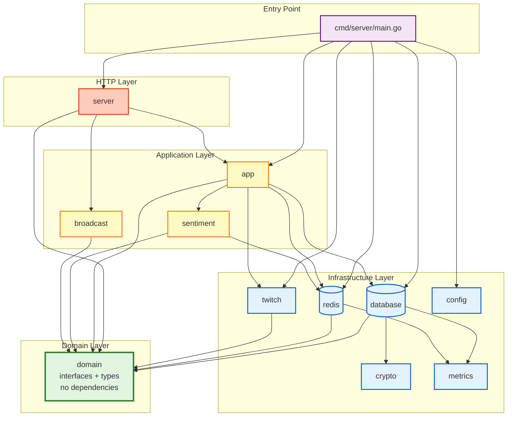

# CLAUDE.md

## Project Overview

ChatPulse - a Go application that tracks real-time chat sentiment for Twitch streamers via an OBS browser source overlay. Uses a dedicated bot account to read chat on behalf of all streamers. Designed as a multi-tenant SaaS supporting horizontal scaling across multiple instances via Redis.

## Build & Run

```bash
make build          # Build binary → ./server
make run            # Build and run locally
make test           # Run all tests (go test -v ./...)
make test-short     # Run unit tests only (go test -short ./...)
make test-race      # Run tests with race detector
make test-coverage  # Generate coverage.out and coverage.html
make fmt            # Format code (go fmt ./...)
make lint           # Run golangci-lint (configured via .golangci.yml)
make deps           # go mod download && go mod tidy
make docker-up      # Start with Docker Compose (app + PostgreSQL + Redis)
make docker-down    # Stop Docker Compose
make clean          # Remove build artifacts
```

Environment is loaded automatically from `.env` via `godotenv` (called inside `config.Load()`), then mapped to `Config` struct fields via `go-simpler/env` struct tags. See `.env.example` for required variables.

## Project Structure

```
cmd/server/main.go          Entry point (setupConfig, setupDB, setupRedis, initWebhooks, runGracefulShutdown)
internal/
  domain/
    errors.go               Sentinel errors (ErrUserNotFound, ErrConfigNotFound, ErrSubscriptionNotFound)
    user.go                 User type, UserRepository interface
    config.go               Config, ConfigSnapshot types, ConfigRepository interface
    session.go              SessionRepository interface (11 methods), SessionUpdate type
    sentiment.go            SentimentStore interface (ApplyVote, GetSentiment, ResetSentiment)
    debounce.go             Debouncer interface (CheckDebounce)
    engine.go               Engine interface (GetCurrentValue, ProcessVote, ResetSentiment)
    twitch.go               EventSubSubscription type, EventSubRepository, TwitchService interfaces
    app.go                  AppService interface
  config/config.go          Struct-tag-based env loading (go-simpler/env), .env file support (godotenv), validation
  crypto/crypto.go          crypto.Service interface, AesGcmCryptoService (AES-256-GCM), NoopService (plaintext passthrough)
  database/
    postgres.go             PostgreSQL connection (pgxpool.Pool), tern-based migrations (embedded SQL)
    user_repository.go      UserRepo: user CRUD, overlay UUID rotation (delegates encryption to crypto.Service)
    config_repository.go    ConfigRepo: config read/update
    eventsub_repository.go  EventSubRepo: EventSub subscription CRUD
    sqlc/schemas/           Schema DDL (shared: sqlc type analysis + tern runtime migrations)
    sqlc/queries/           SQL query definitions for sqlc code generation
    sqlcgen/                Generated Go code from sqlc
  app/service.go            Application layer: orchestrates session lifecycle, cleanup timer, config saves
  redis/
    client.go               Redis connection + Lua library loading (NewClient returns *redis.Client)
    chatpulse.lua           Lua library for Redis Functions (apply_vote, get_decayed_value)
    session_repository.go   SessionRepo: implements domain.SessionRepository (session lifecycle, queries, ref counting, orphan scanning)
    sentiment_store.go      SentimentStore: implements domain.SentimentStore (vote application, decay reads, sentiment reset via Redis Functions)
    debouncer.go            Debouncer: implements domain.Debouncer (SETNX-based per-user debounce with 1s TTL)
  sentiment/
    engine.go               Engine: GetCurrentValue (time-decayed read) + ProcessVote (vote pipeline) + matchTrigger (unexported)
  server/
    server.go               Echo server setup, lifecycle
    routes.go               Route definitions (incl. webhook endpoint)
    handlers.go             Shared helpers (renderTemplate, getBaseURL, session constants)
    handlers_health.go      Health check endpoints (liveness, readiness probes for load balancers)
    handlers_auth.go        Auth middleware, OAuth flow, login/logout
    handlers_dashboard.go   Dashboard page, config save, input validation
    handlers_api.go         REST API endpoints (reset sentiment, rotate overlay UUID)
    handlers_overlay.go     Overlay page + WebSocket upgrade
    connection_limiter.go   WebSocket connection limits (3-layer DoS protection: global, per-IP, rate limiting)
    oauth_client.go         twitchOAuthClient interface + HTTP implementation
  twitch/
    eventsub.go             EventSubManager: Twitch API client, conduit lifecycle, DB-backed subscription management
    webhook.go              EventSub webhook handler (HMAC verification, direct-to-store voting)
  broadcast/
    broadcaster.go          Broadcaster: actor pattern, pull-based tick loop, per-session client management
    writer.go               Per-connection write goroutine (clientWriter, buffered send, ping/pong heartbeat)
  metrics/
    metrics.go              Prometheus metrics (22 metrics: Redis, Broadcaster, WebSocket, Vote, Database, Application)
web/templates/
  login.html                Login page with Twitch OAuth button
  dashboard.html            Streamer config UI (auth required, has logout + rotate URL)
  overlay.html              OBS overlay (glassmorphism, status indicator)
```

## Package Dependency Graph

The following diagram shows the layered architecture and package dependencies. Arrows indicate import direction (A → B means "A imports B").



### Dependency Rules

**✅ Allowed:**
- Infrastructure → Domain (implements interfaces)
- Application → Infrastructure (uses repositories)
- Application → Domain (orchestrates via interfaces)
- Server → Application (calls app services)
- Server → Domain (uses types)
- Main → Everything (wiring only)

**❌ Forbidden:**
- Domain → Anything internal (must stay pure - interfaces and types only)
- Infrastructure ↔ Infrastructure (database ↛ redis, prevents tight coupling)
- Server → Infrastructure directly (must go through Application layer)
- Application → Server (layering violation)

**Key Architectural Principles:**
1. **Domain is the foundation** - No internal dependencies, only stdlib + uuid
2. **Infrastructure is independent** - Each infra package implements domain interfaces without cross-dependencies
3. **Application orchestrates** - Combines multiple infrastructure components via domain interfaces
4. **Server is thin** - Delegates to application layer, never touches infrastructure directly
5. **Main wires it all** - Dependency injection happens only in main.go

**Benefits:**
- ✅ Testability: Each layer can be tested with mocks of the layer below
- ✅ Flexibility: Swap infrastructure (Redis → In-memory) without touching application
- ✅ Clarity: Dependency direction always flows toward domain (stable foundation)
- ✅ Maintainability: Changes in one infrastructure package don't affect others

## Architecture Decision Records

See [`docs/adr/`](docs/adr/) for detailed architectural decision records (ADRs). These documents explain why key decisions were made and what alternatives were considered.

**Start here:** Read the [Tier 1 Foundation ADRs](docs/adr/README.md#tier-1-foundation-adrs) first - they explain the core architecture that all other decisions depend on:

- [ADR-001: Redis-only architecture](docs/adr/001-redis-only-architecture.md) - Why all session state lives in Redis
- [ADR-002: Pull-based broadcaster](docs/adr/002-pull-based-broadcaster.md) - Why we poll Redis instead of using pub/sub
- [ADR-003: EventSub webhooks + conduits](docs/adr/003-eventsub-webhooks-conduits.md) - Why we use webhooks instead of WebSocket

## Key Routes

- `GET /health/live` - Liveness probe (always 200 OK if process alive, for load balancer health checks)
- `GET /health/ready` - Readiness probe (200 OK if all dependencies healthy: Redis, PostgreSQL, Redis Functions; 503 if any check fails)
- `GET /metrics` - Prometheus metrics endpoint (publicly accessible, no auth required for scraping)
- `GET /` - Redirects to `/dashboard`
- `GET /auth/login` - Login page with Twitch OAuth button
- `GET /auth/callback` - Twitch OAuth callback
- `POST /auth/logout` - Clears session, redirects to login page
- `GET /dashboard` - Streamer config page (auth required)
- `POST /dashboard/config` - Save config (auth required, live-updates config)
- `POST /api/reset/:uuid` - Reset sentiment bar (auth required)
- `POST /api/rotate-overlay-uuid` - Generate new overlay URL (auth required)
- `GET /overlay/:uuid` - Serve overlay page (public, uses overlay UUID)
- `GET /ws/overlay/:uuid` - WebSocket endpoint (public, uses overlay UUID)
- `POST /webhooks/eventsub` - Twitch EventSub webhook receiver (when configured)

## Environment Variables

All defined in `.env.example`.

**Required**: `DATABASE_URL`, `TWITCH_CLIENT_ID`, `TWITCH_CLIENT_SECRET`, `TWITCH_REDIRECT_URI`, `SESSION_SECRET`, `REDIS_URL`.

**Webhook group** (all three required together):
- `WEBHOOK_CALLBACK_URL` — Public HTTPS URL for EventSub webhook delivery (required for production)
- `WEBHOOK_SECRET` — HMAC secret for webhook signature verification (10-100 chars)
- `BOT_USER_ID` — Twitch user ID of the dedicated bot account that reads chat

**Optional**:
- `TOKEN_ENCRYPTION_KEY` — 64 hex chars (32 bytes) for AES-256-GCM token encryption at rest; if empty, tokens stored in plaintext
- `MAX_WEBSOCKET_CONNECTIONS` — Maximum total connections per instance (default: 10000)
- `MAX_CONNECTIONS_PER_IP` — Maximum connections from a single IP (default: 100)
- `CONNECTION_RATE_PER_IP` — Maximum new connections per second per IP (default: 10)
- `CONNECTION_RATE_BURST` — Rate limiter burst allowance (default: 20)

## Database

PostgreSQL 15+. Schema managed by [tern](https://github.com/jackc/tern) migrations embedded from `internal/database/sqlc/schemas/`. Three tables:
- `users` — Twitch OAuth data, tokens (encrypted at rest if `TOKEN_ENCRYPTION_KEY` set), expiry, `overlay_uuid` (separate from internal `id`)
- `configs` — Per-user sentiment config (triggers, labels, decay speed)
- `eventsub_subscriptions` — Tracks active EventSub subscriptions per user (user_id FK, broadcaster_user_id, subscription_id, conduit_id)

Database connection returns a bare `*pgxpool.Pool` — no wrapper struct. Repositories accept the pool directly via constructors.

## Architecture Notes

### Scaling Model

Redis-only architecture. Session state lives in Redis, Redis Functions handle atomic vote/decay operations (loaded via `FUNCTION LOAD`, called via `FCALL`/`FCALL_RO`). Multiple instances share state via Redis; ref counting (`IncrRefCount`/`DecrRefCount`) tracks how many instances serve each session. The `Broadcaster` pulls current values from Redis on each tick (50ms) rather than subscribing to push notifications.

### Bot Account Architecture

A single dedicated bot account reads chat on behalf of all streamers:

- **Bot account** authorizes `user:read:chat` + `user:bot` scopes for the app (one-time setup)
- **Streamers** only grant `channel:bot` scope during OAuth login, allowing the bot into their channel
- EventSub subscriptions set `user_id` to the bot's Twitch user ID and `broadcaster_user_id` to the streamer
- `BOT_USER_ID` env var provides the bot's Twitch user ID; stored in `EventSubManager` and threaded to `CreateEventSubSubscription`

### EventSub Transport: Webhooks + Conduits

Chat messages are received via **Twitch EventSub webhooks** transported through a **Conduit**:

- **EventSub Manager** (`twitch/eventsub.go`): Owns the Kappopher `*helix.Client` directly (no separate wrapper). `NewEventSubManager(clientID, clientSecret, ...)` validates credentials via `GetAppAccessToken` (fail-fast) and creates the Helix client internally. Manages conduit lifecycle and EventSub subscriptions. On startup (`Setup`), finds an existing conduit via `GetConduits()` or creates a new one, then configures a webhook shard pointing to the app's `WEBHOOK_CALLBACK_URL`. Creates/deletes EventSub subscriptions targeting the conduit. Handles Twitch 409 Conflict via `helix.APIError` type assertion (subscription already exists) as idempotent success. Subscriptions are persisted in PostgreSQL (`eventsub_subscriptions` table) for idempotency and crash recovery. On subscribe failure after Twitch API success, attempts cleanup. On shutdown (`Cleanup`), deletes the conduit.
- **Webhook Handler** (`twitch/webhook.go`): Receives Twitch POST notifications with Kappopher's built-in HMAC-SHA256 signature verification. Processes votes via `engine.ProcessVote()` through the `domain.Engine` interface. Flow: broadcaster lookup → trigger match → debounce check → atomic vote application.

### Concurrency Model: Actor Pattern

The `Broadcaster` (`broadcast/broadcaster.go`) uses the **actor pattern** — a single goroutine owns all mutable state and receives typed commands via a buffered channel. No mutexes on actor-owned state.

The actor follows this shape:
- Buffered command channel for typed commands (fire-and-forget or request/reply via embedded reply channel)
- Single `run()` goroutine with `select` on commands and ticker, `default` case logging unknown command types
- `Stop()` method for clean shutdown
- Command types use an embedded `baseBroadcasterCmd` struct to satisfy the marker interface

### Context Propagation and Shutdown Timing

**Context patterns:**
- **Request contexts:** Propagated from Echo handlers through all layers (database, Redis, Twitch API). Cancelled when client disconnects.
- **Shutdown context:** Injected into Broadcaster on creation, cancelled by `Stop()` to abort in-flight Redis calls immediately.
- **Background contexts:** Used only for fire-and-forget operations (e.g., orphan cleanup unsubscribe).

**Timeout hierarchy:**
- Broadcaster Redis calls: 2s per-session timeout (circuit breaker threshold)
- Broadcaster shutdown: 10s total (waits for goroutine exit)
- WebSocket write operations: 5s deadline
- Orphan cleanup scan: 30s timeout
- HTTP server shutdown: 30s (Echo graceful shutdown)

**Graceful shutdown sequence:**
1. SIGINT/SIGTERM received
2. `Broadcaster.Stop()` cancels shutdown context → in-flight Redis calls abort immediately
3. Stop command sent to actor → broadcaster exits tick loop
4. WebSocket close frames sent to all clients
5. Wait for broadcaster goroutine exit (max 10s)
6. App cleanup timer stopped
7. EventSub manager cleanup (conduit deletion if owned)
8. Database and Redis connections closed

**Total shutdown time:** <5s under normal conditions, max 15s if broadcaster has hung sessions.

### Cleanup Leader Election

Orphan cleanup runs on only one instance at a time using Redis-based leader election.

**Pattern: Redis SETNX with TTL**

```go
// Try to become leader
ok, _ := rdb.SetNX(ctx, "cleanup:leader", instanceID, 30*time.Second).Result()
if !ok {
    // Another instance is leader, skip cleanup
    return
}

// We're the leader, run cleanup
runCleanup()

// Renew lease every 15s
rdb.Expire(ctx, "cleanup:leader", 30*time.Second)
```

**Benefits:**
- ✅ Eliminates duplicate Twitch API calls (N instances → 1× API calls per cleanup cycle)
- ✅ Reduces Redis SCAN contention (single instance scanning at a time)
- ✅ Prevents goroutine accumulation from duplicate background tasks
- ✅ Graceful leader failover (30s lease renewal, self-healing on leader crash)

**Implementation** (`internal/app/service.go`):
- `LeaderElector` handles lock acquisition, renewal, and release
- Instance ID format: `hostname-PID` (unique across restarts and instances)
- Lock key: `cleanup:leader`, TTL: 30 seconds
- Lease renewal: every 15 seconds (half of TTL for safety margin)
- Graceful release on shutdown (deletes lock only if still owned)

**Failure Modes:**

**Leader crashes:**
- Lock TTL expires after 30s
- Another instance becomes leader on next cleanup cycle (≤30s recovery)
- No manual intervention required

**Leader slow to renew:**
- Renewal happens every 15s (half of 30s TTL)
- If renewal fails, lock expires at 30s
- New leader elected on next cycle (graceful failover)

**Network partition:**
- Leader can't reach Redis → renewal fails → loses leadership
- Other instances elect new leader when TTL expires
- No split-brain (Redis is single source of truth)

**Clock skew:**
- TTL-based expiry is Redis-side, not dependent on instance clocks
- Instance ID collision (same hostname+PID) prevented by process isolation

**Metrics:**

- `cleanup_leader{instance_id}` - 1 if this instance is leader, 0 otherwise
- `cleanup_skipped_total{reason}` - Cleanup cycles skipped (not_leader, leader_lock_failed)
- `leader_election_failures_total{reason}` - Election failures (acquire_failed, renew_failed)

**Operations:**

**Check current leader:**
```bash
redis-cli GET cleanup:leader
# Returns: hostname-PID of current leader
```

**Force leader change** (emergency):
```bash
redis-cli DEL cleanup:leader
# Next instance to run cleanup becomes leader
# Use only if current leader is stuck and not releasing lock
```

**Lock stolen alert:**
If `leader_election_failures_total{reason="lock_stolen"}` fires frequently:
- Indicates clock skew or multiple instances with same instance ID
- Check instance ID generation (hostname + PID should be unique)
- Verify no instances sharing PIDs (e.g., containerized environments with PID 1 reuse)

### Broadcaster (`broadcast/broadcaster.go`)

- Actor goroutine owns the `activeClients` map (session UUID → set of `*clientWriter`). `NewBroadcaster` accepts a `domain.Engine`, an `onFirstClient` callback, an `onSessionEmpty` callback, and a `clockwork.Clock`.
- **Pull-based broadcasting**: A 50ms ticker calls `engine.GetCurrentValue()` for each active session and broadcasts `domain.SessionUpdate{Value, Status: "active"}` to all connected clients. JSON marshaling happens once per session before fanning out.
- **Per-connection write goroutines** (`clientWriter` in `writer.go`): each WebSocket connection gets its own goroutine with a buffered send channel (cap 16), 5-second write deadlines, and periodic ping/pong heartbeat (30s ping interval, 60s pong deadline). Slow clients are disconnected (non-blocking send) instead of blocking all broadcasts.
- **Idle timeout detection** (`writer.go`): Tracks last activity timestamp per client (updated on pong receipt). Clients idle >5 minutes are automatically disconnected. Warning message sent at 4 minutes (1 minute before disconnect). Configurable via `idleTimeout` and `idleWarningTime` constants.
- **Graceful shutdown** (`broadcaster.go`): `Stop()` sends WebSocket close frames (code 1000, reason: "Server shutting down") to all clients, waits for write goroutines to exit, logs disconnection stats. Close frames are sent after the write goroutine exits to prevent concurrent writes.
- **Per-session client cap**: `maxClientsPerSession = 50` prevents resource exhaustion.
- **Session empty callback**: When the last client disconnects from a session, the `onSessionEmpty` callback fires (wired to `app.Service.OnSessionEmpty` in main.go), which decrements the Redis ref count and marks the session as disconnected if no instances serve it.
- **Connection lifecycle metrics**: `websocket_idle_disconnects_total` (idle timeouts), `websocket_connection_duration_seconds` (histogram tracking connection lifetimes from upgrade to close).

### Sentiment Engine (`sentiment/engine.go`)

- No actor, no goroutines. All mutable state lives in Redis.
- Depends on three focused interfaces: `domain.SessionRepository` (session queries), `domain.SentimentStore` (vote/decay operations), and `domain.Debouncer` (per-user rate limiting).
- **Config Cache**: Includes an in-memory `ConfigCache` with 10s TTL that reduces Redis config reads by 99%+. Cache is transparently checked on every `GetCurrentValue()` call. Invalidated explicitly on config updates via `InvalidateConfigCache()`.
- `GetCurrentValue(ctx, sessionUUID)` checks the config cache first (99% hit rate), falls back to Redis on miss, then calls `sentimentStore.GetSentiment()` with the current clock time. The Redis Function computes the time-decayed value atomically.
- `ProcessVote(ctx, broadcasterUserID, chatterUserID, messageText)` encapsulates the full vote pipeline: broadcaster lookup → trigger match → debounce check → atomic vote application.
- `ResetSentiment(ctx, sessionUUID)` delegates to `sentimentStore.ResetSentiment()`.
- Implements `domain.Engine`, consumed by both the `Broadcaster`'s tick loop (reads), the webhook handler (writes), and the app layer (reset).

### SessionRepository Interface (`domain/session.go`)

Abstracts session lifecycle, queries, ref counting, and orphan cleanup (11 methods including `IncrRefCount`/`DecrRefCount` for multi-instance ref counting). Single implementation:

- **`SessionRepo`** (`redis/session_repository.go`): Directly implements `domain.SessionRepository`. Takes `*redis.Client` + `clockwork.Clock`. Mirrors the `database.UserRepo` pattern — single type, single constructor, implements domain interface directly.

### SentimentStore Interface (`domain/sentiment.go`)

Abstracts atomic vote/decay operations (3 methods: `ApplyVote`, `GetSentiment`, `ResetSentiment`). Single implementation:

- **`SentimentStore`** (`redis/sentiment_store.go`): Implements `domain.SentimentStore`. Takes `*redis.Client`; calls Redis Functions (`FCALL`/`FCALL_RO`) for atomic vote application and time-decayed reads. Lua library loaded by `NewClient` at connection time.

### Debouncer Interface (`domain/debounce.go`)

Abstracts per-user vote rate limiting (1 method: `CheckDebounce`). Single implementation:

- **`Debouncer`** (`redis/debouncer.go`): Implements `domain.Debouncer`. Uses Redis `SETNX` with 1s TTL (auto-expires, no pruning needed).

### Vote Rate Limiter Interface (`domain/rate_limit.go`)

Abstracts per-session vote rate limiting using token bucket algorithm (1 method: `CheckVoteRateLimit`). Single implementation:

- **`VoteRateLimiter`** (`redis/vote_rate_limiter.go`): Implements `domain.VoteRateLimiter`. Token bucket via Redis Lua function (`check_vote_rate_limit` in `vote_rate_limit` library). Allows burst traffic (100 tokens initially) while limiting sustained rate (100 tokens/min). Multi-instance safe (atomic Redis Functions). 5-minute TTL auto-expires inactive sessions. Fail-open design: allows votes if Redis errors occur (availability over strict enforcement).

### Vote Processing Pipeline

Votes flow through `engine.ProcessVote()`, which orchestrates four focused interfaces (`SessionRepository` for queries, `SentimentStore` for vote application, `Debouncer` for per-user rate limiting, `VoteRateLimiter` for per-session rate limiting). The webhook handler calls this method through the `domain.Engine` interface. The bot account's `user_id` in the EventSub subscription means Twitch sends all chat messages from channels the bot has joined:

1. Twitch sends `channel.chat.message` webhook → Kappopher verifies HMAC
2. `sessions.GetSessionByBroadcaster(broadcasterUserID)` → session UUID
3. `sessions.GetSessionConfig(sessionUUID)` → config
4. `sentiment.matchTrigger(messageText, config)` → delta (+10, -10, or 0)
5. `debouncer.CheckDebounce(sessionUUID, chatterUserID)` → allowed (SETNX in Redis, 1s per user)
6. `rateLimiter.CheckVoteRateLimit(sessionUUID)` → allowed (token bucket, 100 burst + 100/min sustained)
7. `sentimentStore.ApplyVote(sessionUUID, delta)` → new value (Redis Function: decay + clamp)

Step 7's Redis Function atomically applies the time-decayed vote in Redis. The `Broadcaster`'s next tick (≤50ms later) reads the updated value via `Engine.GetCurrentValue` and broadcasts to local WebSocket clients.

**Rate Limiting Strategy**:
- **Per-user debounce** (step 5): Prevents individual spam (1 vote/second per user)
- **Per-session rate limit** (step 6): Prevents coordinated bot attacks (100 burst, 100/min sustained)
- **Fail-open**: Vote allowed if rate limiter errors (Redis outage doesn't block all votes)
- **Metrics**: `vote_processing_total{result="rate_limited"}`, `vote_rate_limit_checks_total{result}`

### Redis Architecture (`internal/redis/`)

**Key schema**:
- `session:{overlayUUID}` — hash: `value`, `broadcaster_user_id`, `config_json`, `last_disconnect`, `last_update`
- `ref_count:{overlayUUID}` — integer ref count (how many instances serve this session)
- `broadcaster:{twitchUserID}` — string → overlayUUID
- `debounce:{overlayUUID}:{twitchUserID}` — key with 1s TTL (auto-expires, per-user rate limit)
- `rate_limit:votes:{overlayUUID}` — hash: `tokens`, `last_update` (5-min TTL, per-session rate limit)

**Redis Functions** (loaded via `FUNCTION LOAD`, called via `FCALL`/`FCALL_RO`):
- `chatpulse` library:
  - `apply_vote`: `HGET value + last_update → apply time-decay → clamp(decayed + delta, -100, 100) → HSET value + last_update` (read-write, `FCALL`)
  - `get_decayed_value`: `HGET value + last_update → compute time-decayed value → return` (read-only with `no-writes` flag, `FCALL_RO`)
- `vote_rate_limit` library:
  - `check_vote_rate_limit`: Token bucket algorithm: `HGET tokens + last_update → compute refill → check if >= 1 → consume 1 token → HSET` (returns 1=allowed, 0=rejected)

**Circuit Breaker** (`redis/circuit_breaker_hook.go`): Implements `redis.Hook` to wrap all Redis operations with circuit breaker protection using `sony/gobreaker`. Opens after 5 requests @ 60% failure rate, stays open for 10s, allows 3 test requests in half-open state. Provides graceful degradation: read operations (GET/HGET) serve from in-memory cache (5-minute TTL); read-only functions (FCALL_RO for sentiment) return neutral value (0.0); write operations fail fast. Metrics track state transitions and current state (0=closed, 1=half-open, 2=open). See `docs/architecture/circuit-breaker.md` for full details.

### HTTP Server (`internal/server/`)

- **Echo Framework**: Uses Echo v4 with Logger and Recover middleware. Sessions via gorilla/sessions with `sessionMaxAgeDays` (7) expiry, secure cookies in production. `NewServer` returns `(*Server, error)`.
- **Template Caching**: HTML templates (`web/templates/*.html`) are parsed once at startup via `template.ParseFiles()` and cached in the `Server` struct fields (`loginTemplate`, `dashboardTemplate`, `overlayTemplate`). **Production behavior:** Fast rendering (no I/O per request), fail-fast (invalid templates crash at startup, not during request handling). **Development trade-off:** Template changes require app restart to take effect (no hot-reload). Parse errors are fatal — `NewServer()` returns error if any template fails to parse. Templates rendered via `renderTemplate()` helper (`handlers.go`), which executes cached templates directly.
- **Handler File Organization**: Handlers are split by domain — `handlers_auth.go` (auth middleware, OAuth, login/logout), `handlers_dashboard.go` (dashboard page, config save, validation), `handlers_api.go` (REST API), `handlers_overlay.go` (overlay page, WebSocket). Shared helpers (`renderTemplate`, `getBaseURL`, session constants) live in `handlers.go`.
- **Auth Middleware** (`requireAuth` in `handlers_auth.go`): Checks session for user ID, parses UUID, stores in Echo context. Redirects to `/auth/login` if not authenticated.
- **OAuth Flow**: Uses the `twitchOAuthClient` interface (mockable for tests). `GET /auth/login` → generate CSRF state + store in session → Twitch OAuth (scope: `channel:bot`, `state` param) → `/auth/callback` → verify state matches session → `oauthClient.ExchangeCodeForToken()` → `twitchTokenResult` → upsert to DB → create session → `/dashboard`.
- **Error Handling** (`internal/errors/`): Structured error handling with context propagation and HTTP status code mapping. All handlers return structured errors that the error middleware converts to JSON responses. Five error types: `ValidationError` (400), `NotFoundError` (404), `ConflictError` (409), `InternalError` (500), `ExternalError` (502). Errors support context fields via chainable `WithContext(key, value)` / `WithField(key, value)` methods. Error middleware logs errors at appropriate levels (INFO for validation/not-found, WARN for conflicts, ERROR for internal/external), records metrics (`http_errors_total{type}`), and returns JSON responses (`{"error": string, "type": string, "context": map}`). Echo's HTTPError (e.g., from CSRF middleware) is passed through unchanged to preserve original status codes. Example: `return apperrors.ValidationError("invalid UUID").WithField("uuid", uuidStr)`.
- **WebSocket Lifecycle** (`handlers_overlay.go`): `GET /ws/overlay/:uuid` → parse overlay UUID → lookup user → `app.EnsureSessionActive` → `app.IncrRefCount` → upgrade to WebSocket → `broadcaster.Register` → read pump blocks → `broadcaster.Unregister` → `app.OnSessionEmpty`.
- **Graceful Shutdown**: `SIGINT`/`SIGTERM` → `runGracefulShutdown` returns a `done` channel → `server.Shutdown` → `appSvc.Stop` (stops cleanup timer) → `broadcaster.Stop` → `eventsubManager.Cleanup` → `close(done)`. Main goroutine waits on `<-done` after `srv.Start()` returns, ensuring all deferred cleanup (DB close, Redis close) executes properly.

### WebSocket Connection Limits (`internal/server/connection_limiter.go`)

Three-layer defense against DoS attacks and resource exhaustion:

**Layer 1: Global Connection Limit** (atomic counter, lock-free):
- Tracks total active connections across all IPs
- Default: 10,000 connections per instance (configurable via `MAX_WEBSOCKET_CONNECTIONS`)
- Returns 503 Service Unavailable when exceeded
- Prevents file descriptor exhaustion

**Layer 2: Per-IP Connection Limit** (mutex-protected map):
- Limits connections from a single IP address
- Default: 100 connections per IP (configurable via `MAX_CONNECTIONS_PER_IP`)
- Returns 429 Too Many Requests when exceeded
- Handles NAT scenarios (corporate networks behind single IP)
- Auto-cleanup when IP count reaches zero

**Layer 3: Connection Rate Limiting** (token bucket algorithm):
- Prevents connection spam and rapid reconnect attacks
- Default: 10 connections/sec per IP, burst of 20 (configurable via `CONNECTION_RATE_PER_IP`, `CONNECTION_RATE_BURST`)
- Returns 429 Too Many Requests when exceeded
- Uses `golang.org/x/time/rate` package
- Per-IP rate limiters with automatic cleanup (inactive for 10 minutes)

**Enforcement order**: Rate limit → Global limit → Per-IP limit. Checked in `handlers_overlay.go` before WebSocket upgrade via `connLimits.Acquire(clientIP)`. Proper cleanup via `defer connLimits.Release(clientIP)` ensures slots are freed even if upgrade fails. Uses `c.RealIP()` for X-Forwarded-For support behind proxies.

**Rollback on partial failure**: If per-IP limit fails after global limit succeeds, global count is decremented automatically.

**Metrics** (Prometheus):
- `websocket_connections_rejected_total{reason}` — counter by rejection reason (rate_limit, global_limit, ip_limit)
- `websocket_connection_capacity_percent` — gauge (0-100%)
- `websocket_unique_ips` — gauge (number of unique IPs with active connections)

**Configuration** (`.env`):
```bash
MAX_WEBSOCKET_CONNECTIONS=10000  # Global limit per instance
MAX_CONNECTIONS_PER_IP=100       # Per-IP limit
CONNECTION_RATE_PER_IP=10        # Connections per second per IP
CONNECTION_RATE_BURST=20         # Rate limiter burst allowance
```

**Monitoring and Operations**: See [`docs/operations/connection-limits.md`](docs/operations/connection-limits.md) for tuning scenarios (corporate NAT, high-capacity instances, bot attacks), Prometheus alerting rules, load testing instructions, and troubleshooting.

### Application Layer (`app/service.go`)

- Orchestrates all use cases: session activation, ref counting, config saves, overlay UUID rotation, orphan cleanup.
- `EnsureSessionActive`: Uses `singleflight` to collapse concurrent activations. Checks if session exists in Redis; if not, loads user + config from DB, activates in store, and subscribes via Twitch EventSub.
- `OnSessionEmpty`: Decrements Redis ref count; marks session as disconnected when ref count reaches 0 (no instances serving it).
- **Orphan Cleanup Robustness**: 30s ticker calls `CleanupOrphans`, which lists sessions disconnected for >30s. Race condition prevention: validates `ref_count` before deletion via `DeleteSession`, returning `domain.ErrSessionActive` if `ref_count > 0` (session reconnected during scan). Skipped sessions logged at DEBUG level with reason ("active" or "error"). Only successfully deleted sessions trigger background Twitch unsubscribe. Idempotent unsubscribe handles `ErrSubscriptionNotFound` gracefully (DEBUG log, no error metric). Comprehensive metrics: `OrphanCleanupScansTotal`, `OrphanSessionsDeletedTotal`, `OrphanSessionsSkippedTotal{reason}`, `OrphanCleanupDurationSeconds`, `CleanupUnsubscribeErrorsTotal`. See `docs/operations/orphan-cleanup.md` for monitoring and troubleshooting.
- Accepts `domain.UserRepository`, `domain.ConfigRepository`, `domain.SessionRepository`, `domain.Engine`, and `domain.TwitchService` (nil-safe for the Twitch dependency when webhooks are not configured). `ResetSentiment` delegates to the `Engine`, which in turn delegates to `SentimentStore`.
- Also exposes 4 pass-through read methods (`GetUserByID`, `GetUserByOverlayUUID`, `GetConfig`, `UpsertUser`) so handlers never access repositories directly.

### Domain Package (`internal/domain/`)

Concept-oriented files containing all shared types and cross-cutting interfaces:
- **`errors.go`**: Sentinel errors `ErrUserNotFound`, `ErrConfigNotFound`, `ErrSubscriptionNotFound`, `ErrSessionActive` — returned by repository `Get*` methods when no row matches and by `Update*` methods when 0 rows are affected. `ErrSessionActive` returned by `DeleteSession` when `ref_count > 0` (session reconnected, unsafe to delete). Repositories translate `pgx.ErrNoRows` (for `:one` queries) and zero `RowsAffected()` (for `:execresult` queries) into these domain errors so consumers never import `pgx` directly.
- **`user.go`**: `User` type, `UserRepository` interface (5 methods)
- **`config.go`**: `Config`, `ConfigSnapshot` types, `ConfigRepository` interface (2 methods)
- **`session.go`**: `SessionRepository` interface (11 methods), `SessionUpdate` type
- **`sentiment.go`**: `SentimentStore` interface (3 methods: `ApplyVote`, `GetSentiment`, `ResetSentiment`)
- **`debounce.go`**: `Debouncer` interface (1 method: `CheckDebounce`)
- **`engine.go`**: `Engine` interface (3 methods: `GetCurrentValue`, `ProcessVote`, `ResetSentiment`)
- **`twitch.go`**: `EventSubSubscription` type, `EventSubRepository` (4 methods), `TwitchService` (2 methods)
- **`app.go`**: `AppService` interface (10 methods)
- Imports only stdlib + `github.com/google/uuid` — no internal dependencies, preventing circular imports.

### Other Architecture Notes

- **Repository vs Service Naming**: The codebase uses two naming patterns based on purpose. **Repository pattern** (CRUD operations on entities): Interface = `domain.XxxRepository`, Implementation = `database.XxxRepo` or `redis.XxxRepo`. Example: `UserRepository` interface implemented by `database.UserRepo`. **Service pattern** (specialized operations, not CRUD): Interface and implementation use the same name (no `Impl` suffix - Go antipattern). Package disambiguates. Example: `SentimentStore` interface implemented by `redis.SentimentStore`, `Debouncer` interface implemented by `redis.Debouncer`. Rationale: Repository pattern benefits from name distinction (Repo vs Repository) for IDE navigation and grep. Service pattern doesn't need suffix since operations aren't generic CRUD.
- **Config Caching**: In-memory TTL-based cache (10s TTL) reduces Redis config reads by 99%+. Broadcaster ticks 20×/sec, first tick misses cache (1 Redis read), next 199 ticks hit cache (0 Redis reads) = 99.5% hit rate. Automatic eviction via background timer (1-minute interval). Explicitly invalidated on config updates. Thread-safe via RWMutex. Memory: ~122 bytes/session (negligible at 10K sessions = 2 MB). See `docs/architecture/config-caching.md` for full details. Implemented in `sentiment.ConfigCache`, integrated into `sentiment.Engine.GetCurrentValue()`.
- **Template Caching**: Templates (`web/templates/*.html`) are parsed once at startup and cached in the `Server` struct (`loginTemplate`, `dashboardTemplate`, `overlayTemplate`). **Production:** Fast rendering (no parsing overhead), fail-fast on invalid templates at startup. **Development:** Template changes require app restart (acceptable for infrequent template changes). Alternative considered: Hot-reload in dev mode (check `APP_ENV`, parse on each request) - rejected for minimal DX improvement vs added complexity. Workaround: Use air or modd for auto-restart. Template paths are hardcoded (`web/templates/login.html`, etc.) as template location is stable.
- **Trigger Matching**: `matchTrigger()` — unexported pure function in `engine.go`, case-insensitive exact match (trimmed). "For" trigger takes priority when both match. Returns +`voteDelta`, -`voteDelta`, or 0 (`voteDelta` = 10.0).
- **Vote Clamping**: Values clamped to [-100, 100].
- **Debounce**: 1 second per user per session. `domain.Debouncer` interface, implemented by `redis.Debouncer` using `SETNX` with 1s TTL (auto-expires, no pruning needed).
- **Overlay UUID Separation**: The overlay URL uses a separate `overlay_uuid` column (not the user's internal `id`). Users can rotate their overlay UUID via `POST /api/rotate-overlay-uuid` to invalidate old URLs.
- **Token Encryption at Rest**: AES-256-GCM encryption for access/refresh tokens in PostgreSQL. Handled by `crypto.Service` interface — `AesGcmCryptoService` (production, takes 64-char hex key) or `NoopService` (dev/test, plaintext passthrough). Injected into `UserRepo` via constructor. Nonce prepended to ciphertext, hex-encoded for TEXT column storage.
- **UpsertUser Transaction**: User creation and default config insertion are wrapped in a single database transaction for atomicity. Lives in `UserRepo.Upsert()`. Uses `toDomainUser()` helper for consistent row mapping + token decryption.
- **Connection Status Broadcasting**: Broadcaster sends `{"value": float, "status": "active"}` on each tick. Overlay shows "reconnecting..." indicator when status !== "active".
- **Context Propagation**: All DB queries and HTTP calls accept `context.Context` as first parameter for cancellation support.

### Error Handling

See [`docs/ERROR_HANDLING.md`](docs/ERROR_HANDLING.md) for error handling standards and patterns:

- **3-Tier Error Classification:** Domain errors (Tier A - sentinel errors, unwrapped, no logs at origin), Infrastructure errors (Tier B - wrapped with context, logged at origin), Programming errors (Tier C - panics, caught by middleware)
- **Logging Rules:** Log at decision boundary (handlers, middleware), not at origin (repositories). Exception: infrastructure errors ARE logged at origin with full context.
- **Structured Logging:** Consistent snake_case field names (`user_id`, `session_uuid`, `broadcaster_user_id`), required fields (`error`, message), structured context
- **Code Examples:** Repositories (return sentinel errors unwrapped), Handlers (log at decision boundary), Application services (pass through without logging)

## Testability Interfaces

The codebase uses consumer-side interfaces for testability. Cross-cutting interfaces live in `domain/` (split across concept-oriented files); package-private interfaces stay with their single consumer.

**Domain interfaces** (in `domain/` package):
- **`domain.SessionRepository`** (`session.go`) — abstracts session lifecycle, queries, ref counting, orphan cleanup (11 methods). Implemented by `redis.SessionRepo` (with `clockwork.Clock` injection).
- **`domain.SentimentStore`** (`sentiment.go`) — abstracts atomic vote/decay operations (3 methods: `ApplyVote`, `GetSentiment`, `ResetSentiment`). Implemented by `redis.SentimentStore`.
- **`domain.Debouncer`** (`debounce.go`) — abstracts per-user vote rate limiting (1 method: `CheckDebounce`). Implemented by `redis.Debouncer`.
- **`domain.Engine`** (`engine.go`) — 3-method interface: `GetCurrentValue`, `ProcessVote`, `ResetSentiment`. Implemented by `sentiment.Engine`. Consumed by `broadcast.Broadcaster` (reads), `twitch.WebhookHandler` (writes), and `app.Service` (reset).
- **`domain.UserRepository`** — 5-method interface (`GetByID`, `GetByOverlayUUID`, `Upsert`, `UpdateTokens`, `RotateOverlayUUID`). Implemented by `database.UserRepo`.
- **`domain.ConfigRepository`** — 2-method interface (`GetByUserID`, `Update`). Implemented by `database.ConfigRepo`.
- **`domain.EventSubRepository`** — 4-method interface (`Create`, `GetByUserID`, `Delete`, `List`). Implemented by `database.EventSubRepo`.
- **`domain.AppService`** — 10-method contract between server and app layer. Includes 4 read pass-throughs (`GetUserByID`, `GetUserByOverlayUUID`, `GetConfig`, `UpsertUser`) + 6 operations (`EnsureSessionActive`, `IncrRefCount`, `OnSessionEmpty`, `ResetSentiment`, `SaveConfig`, `RotateOverlayUUID`). Implemented by `app.Service`. Handlers depend only on this interface — no direct repository access.
- **`domain.TwitchService`** — `Subscribe`, `Unsubscribe`. Implemented by `twitch.EventSubManager`.

**Package-private interfaces** (single consumer, stay local):
- **`server.twitchOAuthClient`** — `ExchangeCodeForToken(ctx, code) (*twitchTokenResult, error)`. Production implementation wraps Twitch HTTP APIs; tests use `mockOAuthClient`.
- **`server.webhookHandler`** — `HandleEventSub(c echo.Context) error`. Nil when webhooks not configured.
- **`twitch.subscriptionStore`** — 3-method interface (`Create`, `GetByUserID`, `Delete`) satisfied by `database.EventSubRepo`; used by `EventSubManager`.
- **`clockwork.Clock`** — injected into `sentiment.Engine`, `redis.SessionRepo`, `app.Service`, and `broadcast.Broadcaster` (threaded to `clientWriter` for write deadlines, ping tickers, and pong read deadlines) for deterministic time control in tests.

### Testing with the Actor Pattern

The `Broadcaster` uses an actor pattern. Tests use synchronous queries (e.g., `GetClientCount()`) as **barrier calls** — the reply won't come until all prior commands in the channel are processed. For `CleanupOrphans` (in `app.Service`), Twitch unsubscribe calls run in a background goroutine — tests use a channel with timeout to wait for completion.

## Testing

181 tests across 8 packages. Run with `make test` or `go test ./...`.

### Test Types

**Unit tests** (fast, no external dependencies):
- Run with `make test-short` or `go test -short ./...`
- Complete in <2 seconds
- Use mocks for all external dependencies

**Integration tests** (use real infrastructure):
- Run with `make test` or `go test ./...`
- Complete in ~15 seconds
- Use testcontainers for PostgreSQL and Redis, real WebSockets, mock HTTP servers for external APIs
- Automatically skipped with `-short` flag via `if testing.Short() { t.Skip(...) }`

**Coverage analysis**:
- Run with `make test-coverage` to generate `coverage.out` and `coverage.html`
- Race detection: `make test-race` (runs tests with `-race`)

### Test File Organization

**Naming conventions:**

- **Unit tests:** `<feature>_test.go`
  - Use mocks for all external dependencies
  - Fast execution (<100ms per test)
  - No Docker, no testcontainers
  - Example: `internal/sentiment/engine_test.go`, `internal/server/handlers_unit_test.go`

- **Integration tests:** `<feature>_integration_test.go`
  - Use real infrastructure (PostgreSQL, Redis via testcontainers)
  - Slower execution (100ms-1s per test)
  - Require Docker daemon running
  - Example: `internal/redis/session_repository_integration_test.go`, `internal/database/user_repository_integration_test.go`

**Running specific test types:**

```bash
# All tests (unit + integration, ~15s)
make test

# Unit tests only (fast feedback, <2s)
make test-short
make test-unit  # Alias for test-short

# Integration tests only (~12s)
make test-integration

# Single package
go test ./internal/redis
go test -short ./internal/app  # Unit tests only in app package
```

**Mixed test files:**

Some packages contain BOTH unit and integration tests in the same file:
- Integration tests check `testing.Short()` and skip if `-short` flag set
- This is acceptable but separate files are preferred for clarity

Example pattern:
```go
func TestIntegrationFeature(t *testing.T) {
    if testing.Short() {
        t.Skip("Skipping integration test")
    }
    // Integration test code...
}
```

**Test infrastructure files:**

Shared test helpers use plain `_test.go` naming (not `_integration_test.go`):
- Example: `internal/server/handlers_test.go` contains mocks + setup helpers
- Used by both unit and integration tests

### Integration Tests with Testcontainers

Integration tests use **testcontainers** for PostgreSQL and Redis (real infrastructure, not mocks):

**Benefits:**
- Real database behavior (catches schema/query issues, constraint violations)
- Production-like environment (same PostgreSQL/Redis versions)
- Docker standardization across team (no "works on my machine")

**Overhead:**
- First run: 3-7s container startup (PostgreSQL + Redis pull + start)
- Subsequent runs: <1s (containers cached in Docker)
- CI: 15s total (acceptable for full integration coverage)

**TDD workflow:**
1. Use `go test -short ./...` or `make test-short` for rapid feedback (<2s, no Docker)
2. Run full suite before commit (`make test`, ~15s with containers)
3. CI runs full suite on every push

**Why testcontainers over mocks?**
- Database mocks don't catch SQL errors, constraint violations, or migration issues
- Redis mocks don't replicate Lua function behavior or atomic operation guarantees
- Integration tests provide higher confidence for data layer (real PostgreSQL queries, real Redis Functions)

**Skipping integration tests:**
All integration tests check `testing.Short()`:
```go
if testing.Short() {
    t.Skip("Skipping integration test")
}
```

### Test Files

- `internal/config/config_test.go` — env loading, defaults, validation, encryption key validation, webhook config validation
- `internal/crypto/crypto_test.go` — AesGcmCryptoService: key validation, encrypt/decrypt roundtrip, unique nonces, tampered ciphertext, NoopService passthrough (9 tests)
- `internal/database/postgres_integration_test.go` — connection, tern migrations, schema verification (testcontainers)
- `internal/database/user_repository_integration_test.go` — user CRUD, token encryption via crypto.Service, overlay UUID rotation, not-found error paths, encryption key mismatch (testcontainers)
- `internal/database/config_repository_integration_test.go` — config read/update, not-found error path (testcontainers)
- `internal/database/eventsub_repository_integration_test.go` — EventSub subscription CRUD, upsert, list; includes `createTestUser` helper (testcontainers)
- `internal/redis/integration_test.go` — test setup: testcontainers Redis, `setupTestClient` helper
- `internal/redis/client_integration_test.go` — Redis Function loading test (testcontainers)
- `internal/redis/session_repository_integration_test.go` — session CRUD, broadcaster mapping, ref counting, orphan listing (testcontainers)
- `internal/redis/sentiment_store_integration_test.go` — vote application, clamping, decay, sentiment read (testcontainers)
- `internal/redis/debouncer_integration_test.go` — debounce TTL behavior (testcontainers)
- `internal/sentiment/config_cache_test.go` — ConfigCache unit tests: cache hit/miss, TTL expiry, eviction, invalidation, concurrency (12 tests)
- `internal/sentiment/config_cache_integration_test.go` — ConfigCache integration tests: 99.99% hit rate validation, TTL refresh, invalidation, multi-session isolation, concurrent access (5 tests)
- `internal/sentiment/config_cache_bench_test.go` — ConfigCache benchmarks: Get/Set performance, memory usage (100/1K/10K sessions), cache hit vs miss (13× faster), concurrent workloads (9 benchmarks)
- `internal/sentiment/engine_test.go` — GetCurrentValue (4 tests) + ProcessVote (8 tests) + matchTrigger (9 tests): three focused mocks (`mockSessionRepo`, `mockSentimentStore`, `mockDebouncer`)
- `internal/app/service_test.go` — EnsureSessionActive, OnSessionEmpty, IncrRefCount, ResetSentiment, SaveConfig, RotateOverlayUUID, CleanupOrphans, Stop (14 tests)
- `internal/broadcast/broadcaster_test.go` — register, tick broadcast, multiple clients, session empty callback, client cap, value updates (7 tests)
- `internal/server/handlers_test.go` — shared test infrastructure: mocks (`mockAppService`, `mockOAuthClient`), helpers (`newTestServer`, `setSessionUserID`, `withOAuthClient`)
- `internal/server/handlers_unit_test.go` — input validation tests (validateConfig: 100% coverage)
- `internal/server/handlers_auth_test.go` — requireAuth middleware, login page, logout, OAuth callback (success, missing code, invalid state, exchange error, DB error) (10 tests)
- `internal/server/handlers_dashboard_test.go` — handleDashboard, handleSaveConfig (5 tests)
- `internal/server/handlers_api_test.go` — handleResetSentiment, handleRotateOverlayUUID (5 tests)
- `internal/server/handlers_overlay_test.go` — handleOverlay (3 tests)
- `internal/server/connection_limiter_test.go` — connection limits unit tests: global limit, per-IP limit, rate limit, concurrent access, capacity, cleanup, rollback (19 tests)
- `internal/server/connection_limits_integration_test.go` — connection limits integration tests: global limit enforcement, per-IP limit enforcement, rate limit enforcement, release on disconnect, concurrent connections (6 tests)
- `internal/twitch/webhook_test.go` — webhook handler tests with HMAC-signed requests: trigger matching, debounce, invalid signature, non-chat events (5 tests)

### Test Dependencies

- **`stretchr/testify`** — assertions and require helpers
- **`jonboulle/clockwork`** — fake clock for deterministic time control
- **`testcontainers-go`** — container orchestration (v0.40.0)
- **`testcontainers-go/modules/postgres`** — PostgreSQL module
- **`testcontainers-go/modules/redis`** — Redis module

### Coverage Targets

**Minimum:** 70% overall coverage (enforced in CI)

**Per-package targets:**
- `sentiment/`: 90%+ (core business logic, critical for correctness)
- `broadcast/`: 85%+ (concurrency patterns need thorough testing)
- `redis/`: 80%+ (integration tests cover most Redis operations)
- `app/`: 80%+ (orchestration layer, many edge cases)
- `server/`: 75%+ (handler logic, auth flows)
- `database/`: 75%+ (repository CRUD operations)
- `crypto/`: 90%+ (security-sensitive code)
- `config/`: 60%+ (simple validation logic)
- `twitch/`: 75%+ (webhook processing, EventSub integration)
- `metrics/`: 60%+ (metric definitions, registration)

**Note:** 100% coverage is not the goal. Focus on critical paths (domain logic, Redis operations, HTTP handlers). Template rendering and simple getters are lower priority.

### Database Integration Tests (testcontainers)

**Setup**: `TestMain()` starts a PostgreSQL 15 container once, reused across all tests (~2-5s overhead total)
**Cleanup**: Each test uses `setupTestDB(t)` which registers a cleanup function to `TRUNCATE users, configs, eventsub_subscriptions CASCADE`
**Production fidelity**: Real PostgreSQL behavior, real schema, real constraints, real encryption

### Redis Integration Tests (testcontainers)

**Setup**: `TestMain()` starts a Redis 7 container once, reused across all tests (~1-2s overhead)
**Cleanup**: Each test calls `FlushAll` before running
**Tests cover**: Session CRUD, broadcaster mapping, ref counting, orphan scanning (SessionRepo); vote application, clamping, decay, sentiment reads (SentimentStore); debounce TTL (Debouncer); Redis Function loading (client)

### Server Validation Tests (unit)

**Input Validation** (`internal/server/handlers_unit_test.go`):
- Empty trigger detection (for/against), length limits (triggers: 500, labels: 50), decay range (0.1-2.0), identical trigger prevention

## Observability

ChatPulse exposes comprehensive Prometheus metrics for monitoring application health, performance, and business metrics.

### Metrics Endpoint

**Route**: `GET /metrics`

**Access**: Publicly accessible (no authentication required for Prometheus scraping)

**Format**: Prometheus exposition format (text/plain)

**Documentation**: See [`docs/operations/prometheus-metrics.md`](docs/operations/prometheus-metrics.md) for complete metrics catalog, PromQL queries, alert examples, and Grafana dashboard configuration.

### Instrumentation

**22 metrics across 6 categories:**

1. **Redis Metrics** (`internal/redis/metrics_hook.go`)
   - Implemented via `redis.Hook` interface for automatic operation tracking
   - Tracks all Redis operations (get, set, fcall, hget, etc.) by status (success, error)
   - Histogram for operation latency distribution
   - Connection pool state (active/idle connections)

2. **Broadcaster Metrics** (`internal/broadcast/broadcaster.go`)
   - Active sessions and connected clients (gauges)
   - Tick loop duration (50ms target)
   - Broadcast fanout duration per session
   - Slow client evictions (buffer full)

3. **WebSocket Metrics** (`internal/server/handlers_overlay.go`, `internal/broadcast/writer.go`)
   - Connection lifecycle: total attempts by result (success/error/rejected), current active connections
   - Connection limits: capacity utilization (0-100%), unique IPs, rejection reasons (rate_limit/global_limit/ip_limit)
   - Performance: connection duration histogram, message send duration, ping/pong failures

4. **Vote Processing Metrics** (`internal/sentiment/engine.go`)
   - Vote pipeline: total votes by result (applied/debounced/invalid/no_session/error)
   - Processing latency distribution
   - Trigger matches by type (for/against)
   - Rate limiter token bucket state

5. **Database Metrics** (`internal/database/metrics_tracer.go`)
   - Implemented via `pgx.QueryTracer` interface
   - Query latency histogram by query name (extracted from SQL comments or first 50 chars)
   - Connection pool state (active/idle connections)
   - Query errors by query name

6. **Application Metrics** (`internal/app/service.go`)
   - Config cache hit/miss rates, entry count, evictions
   - Background cleanup errors (Twitch unsubscribe failures)

### Prometheus Configuration

```yaml
# prometheus.yml
scrape_configs:
  - job_name: 'chatpulse'
    scrape_interval: 15s
    scrape_timeout: 10s
    metrics_path: '/metrics'
    static_configs:
      - targets: ['chatpulse:8080']
```

### Alert Examples

```yaml
# High Redis error rate
- alert: HighRedisErrorRate
  expr: rate(redis_operations_total{status="error"}[5m]) > 0.05
  for: 2m

# WebSocket capacity
- alert: HighWebSocketCapacity
  expr: websocket_connection_capacity_percent > 80
  for: 5m

# Vote processing errors
- alert: VoteProcessingErrors
  expr: rate(vote_processing_total{result="error"}[5m]) > 0.01
  for: 2m
```

### Key PromQL Queries

```promql
# Redis operation rate by type
rate(redis_operations_total[5m])

# 95th percentile Redis latency
histogram_quantile(0.95, rate(redis_operation_duration_seconds_bucket[5m]))

# Vote application rate
rate(vote_processing_total{result="applied"}[5m])

# WebSocket connection growth
deriv(websocket_connections_current[5m])
```

### Design Principles

- **Automatic instrumentation**: Redis (hook), Database (tracer), HTTP (middleware) use framework integration
- **Bounded cardinality**: All labels have fixed sets (<100 unique values) to prevent metric explosion
- **Histogram buckets**: Tailored to expected latencies (Redis: 1-100ms, WebSocket: 100µs-250ms, DB: 1ms-10s)
- **Business + technical metrics**: Track both vote rates (business) and latency (technical) for full observability

## Linting

golangci-lint v2 configured via `.golangci.yml` (schema `version: "2"`). Run with `make lint`.

**Enabled linters** (beyond the `standard` default set): bodyclose, durationcheck, errorlint, fatcontext, goconst, gocritic (diagnostic + performance tags), misspell, nilerr, noctx, prealloc, unconvert, unparam, wastedassign.

**Suppressed patterns** (intentional, not bugs):
- `errcheck` on `Close()`, `SetWriteDeadline()`, `SetReadDeadline()`, `SetPongHandler()` for standard cleanup/setup patterns
- `exitAfterDefer` — standard Go pattern in `main()` and `TestMain()`
- `middleware.Logger` deprecation — replacing requires larger refactor
- `bodyclose` in test files — false positive on WebSocket `Dial()`

## Go Module

Module: `github.com/pscheid92/chatpulse`, Go 1.26.0.

Key deps: echo/v4, gorilla/websocket, gorilla/sessions, Its-donkey/kappopher, jackc/pgx/v5, jackc/tern/v2, redis/go-redis/v9, google/uuid, joho/godotenv, jonboulle/clockwork, go-simpler/env.

Test deps: stretchr/testify, jonboulle/clockwork, testcontainers-go, testcontainers-go/modules/postgres, testcontainers-go/modules/redis.

## Deployment Documentation

Production deployment guides for various environments:

- **Load Balancers:**
  - [`docs/deployment/load-balancer-nginx.md`](docs/deployment/load-balancer-nginx.md) — Nginx reverse proxy configuration with WebSocket support, health checks, performance tuning
  - [`docs/deployment/load-balancer-aws-alb.md`](docs/deployment/load-balancer-aws-alb.md) — AWS Application Load Balancer with Terraform, auto-scaling, target groups
  - [`docs/deployment/load-balancer-kubernetes.md`](docs/deployment/load-balancer-kubernetes.md) — Kubernetes Ingress (nginx-ingress, AWS ALB Ingress, Traefik) with HPA, PDB, sticky sessions
- **Operations:**
  - [`docs/deployment/graceful-shutdown.md`](docs/deployment/graceful-shutdown.md) — Graceful shutdown behavior, timeout configuration for Docker/Kubernetes/ECS, testing procedures
  - [`docs/deployment/troubleshooting-load-balancer.md`](docs/deployment/troubleshooting-load-balancer.md) — Common issues (502 errors, WebSocket failures, SSL/TLS), diagnostics, monitoring alerts

**Key deployment requirements:**
- WebSocket idle timeout: 3600s (1 hour) for long-lived overlay connections
- Health checks: `/health/ready` (readiness), `/health/live` (liveness)
- Sticky sessions: Recommended for overlay clients to reconnect to same instance
- Graceful shutdown: 60s timeout (30s HTTP drain + 30s cleanup)
- Minimum replicas: 3 for high availability
- Load balancing: Use `least_conn` (Nginx) or sticky sessions (ALB/Kubernetes) for even distribution

### Dependency Changes (Feb 2026 Architecture Overhaul)

| Removed | Added |
|---------|-------|
| `github.com/nicklaw5/helix/v2` | `github.com/Its-donkey/kappopher` v1.1.1 |
| | `github.com/jackc/tern/v2` v2.3.5 |
| | `github.com/redis/go-redis/v9` v9.17.3 |
| | `github.com/testcontainers/testcontainers-go/modules/redis` v0.40.0 |
| | `go-simpler.org/env` v0.12.0 |

### Files Deleted / Renamed

- `internal/twitch/eventsub.go` — 660-line EventSub WebSocket actor with 5-state FSM (replaced by webhooks + conduits)
- `internal/twitch/token.go` — Token refresh middleware (replaced by Kappopher's built-in token management)
- `internal/twitch/token_test.go` — Tests for deleted token code
- `internal/twitch/helix.go` → `internal/twitch/client.go` → merged into `internal/twitch/eventsub.go` — Helix API wrapper merged into `EventSubManager`; `eventsubAPIClient` interface removed
- `internal/sentiment/store_redis.go` → `internal/redis/store.go` — Moved Redis store adapter out of domain package; renamed `RedisStore` to `SentimentStore` (later consolidated into `SessionStore`)
- `internal/models/user.go` — Model types (`User`, `Config`, `ConfigSnapshot`, `EventSubSubscription`) moved to `internal/domain/`; `models` package deleted
- `internal/sentiment/store.go` — `SessionStore`, `VoteStore`, `SessionUpdate` moved to `internal/domain/`
- `internal/sentiment/vote.go` — `ProcessVote` moved to `Engine.ProcessVote` method in `engine.go`; `domain.VoteStore` interface removed (Engine uses `SessionStore` directly)
- `internal/sentiment/trigger.go` — `MatchTrigger` moved into `engine.go` as unexported `matchTrigger`; tests merged into `engine_test.go`
- `internal/domain/domain.go` — Split into concept-oriented files: `errors.go`, `user.go`, `config.go`, `session.go`, `engine.go`, `twitch.go`, `app.go`. `SessionStateStore` renamed to `SessionStore`, `ScaleProvider` renamed to `Engine`, dead `GetSessionValue` method removed.
- `internal/sentiment/store_memory.go` — In-memory store removed (Redis-only architecture)
- `internal/websocket/hub.go` → `internal/broadcast/broadcaster.go` — Replaced push-based Hub with pull-based `Broadcaster` (package renamed from `websocket` to `broadcast`, type renamed from `OverlayBroadcaster` to `Broadcaster`)
- `internal/websocket/commands.go` — Hub command types removed (broadcaster defines its own internally)
- `internal/redis/pubsub.go` — Pub/Sub removed (broadcaster pulls values instead of subscribing)
- `internal/twitch/conduit.go` + `internal/twitch/subscription.go` → `internal/twitch/eventsub.go` — Merged `ConduitManager` and `SubscriptionManager` into single `EventSubManager`; `conduitID` internalized
- `internal/database/postgres.go` — Removed `DB` wrapper struct (was `*pgxpool.Pool` + `cipher.AEAD`); `Connect()` now returns bare `*pgxpool.Pool`; inline migrations replaced by tern; `HealthCheck()` removed
- Token encrypt/decrypt methods extracted from `UserRepo` → new `internal/crypto/crypto.go` (`crypto.Service` interface)
- `sqlc/` (repo root) → `internal/database/sqlc/` — Moved sqlc schemas + queries under database package for `//go:embed` compatibility; `schema.sql` renamed to `001_initial.sql` (tern migration format, dual-use with sqlc)
- `internal/redis/scripts.go` → `internal/redis/functions.go` → merged into `internal/redis/store.go` — Replaced `ScriptRunner` + `EVAL`/`EVALSHA` with `FunctionRunner` + `FCALL`/`FCALL_RO`; Lua code extracted to embedded `chatpulse.lua` library; then consolidated into `SessionStore`
- `internal/redis/scripts_test.go` → `internal/redis/functions_test.go` → merged into `internal/redis/store_test.go`
- `internal/redis/session.go` + `internal/redis/functions.go` + `internal/redis/store.go` — Consolidated three types (`SessionStore` + `FunctionRunner` + `SentimentStore`) into single `SessionRepo` in `store.go` that directly implements `domain.SessionRepository`; `session_test.go` + `functions_test.go` merged into `store_integration_test.go`. Later split into `session_repository.go` (SessionRepo), `sentiment_store.go` (SentimentStore), and `debouncer.go` (Debouncer).
- `domain.SessionStore` → `domain.SessionRepository` — Renamed to match `UserRepository`/`ConfigRepository` convention; implementation renamed `SentimentStore` → `SessionRepo`
- `domain.SessionRepository` (15 methods) → split into `SessionRepository` (11), `SentimentStore` (3), `Debouncer` (1) — Extracted `ApplyVote`/`GetSentiment`/`ResetSentiment` into `domain.SentimentStore` (`redis.SentimentStore`), `CheckDebounce` into `domain.Debouncer` (`redis.Debouncer`)
