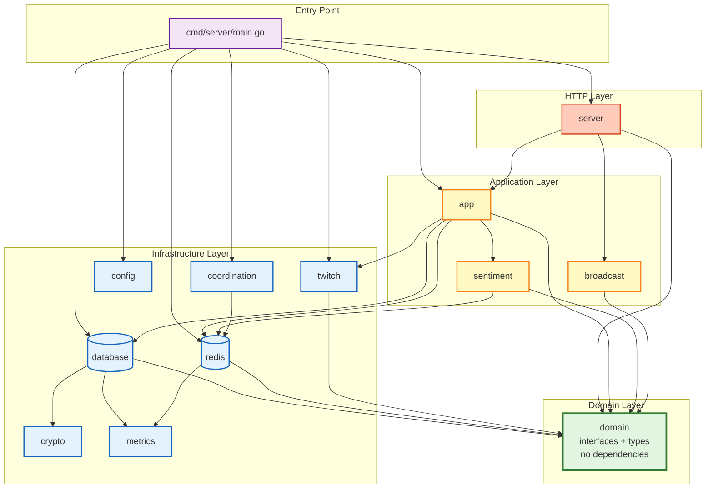

# CLAUDE.md

## Project Overview

ChatPulse - a Go application that tracks real-time chat sentiment for Twitch streamers via an OBS browser source overlay. Uses a dedicated bot account to read chat on behalf of all streamers. Designed as a multi-tenant SaaS supporting horizontal scaling across multiple instances via Redis.

## Build & Run

```bash
make build          # Build binary → ./server
make run            # Build and run locally
make test           # Run all tests (go test -v ./...)
make test-short     # Run unit tests only (go test -short ./...)
make test-race      # Run tests with race detector
make test-coverage  # Generate coverage.out and coverage.html
make fmt            # Format code (go fmt ./...)
make lint           # Run golangci-lint (configured via .golangci.yml)
make deps           # go mod download && go mod tidy
make docker-up      # Start with Docker Compose (app + PostgreSQL + Redis)
make docker-down    # Stop Docker Compose
make clean          # Remove build artifacts
```

Environment is loaded automatically from `.env` via `godotenv` (called inside `config.Load()`), then mapped to `Config` struct fields via `go-simpler/env` struct tags. See `.env.example` for required variables.

## Project Structure

```
cmd/server/main.go          Entry point (setupConfig, setupDB, setupRedis, initWebhooks, runGracefulShutdown)
internal/
  domain/
    errors.go               Sentinel errors (ErrUserNotFound, ErrConfigNotFound, ErrSubscriptionNotFound, ErrSessionActive)
    user.go                 User type, UserRepository interface
    config.go               Config, ConfigSnapshot types, ConfigRepository interface
    session.go              SessionRepository interface (11 methods), SessionUpdate type
    sentiment.go            SentimentStore interface (ApplyVote, GetSentiment, ResetSentiment)
    debounce.go             Debouncer interface (CheckDebounce)
    rate_limit.go           VoteRateLimiter interface (CheckVoteRateLimit)
    engine.go               Engine interface (GetCurrentValue, ProcessVote, ResetSentiment)
    twitch.go               EventSubSubscription type, EventSubRepository, TwitchService interfaces
    app.go                  AppService interface
  config/config.go          Struct-tag-based env loading, validation
  crypto/crypto.go          crypto.Service interface, AesGcmCryptoService (AES-256-GCM), NoopService
  database/
    postgres.go             PostgreSQL connection (pgxpool.Pool), tern-based migrations
    *_repository.go         Repository implementations (User, Config, EventSub)
    sqlc/schemas/           Schema DDL (tern migrations + sqlc type analysis)
    sqlc/queries/           SQL query definitions for sqlc
    sqlcgen/                Generated Go code from sqlc
  app/
    service.go              Application orchestration (session lifecycle, cleanup, config saves)
    leader.go               Leader election for orphan cleanup
    reconciler.go           Config drift detection and auto-correction
  redis/
    client.go               Redis connection + Lua library loading
    chatpulse.lua           Lua library for Redis Functions (apply_vote, get_decayed_value)
    vote_rate_limit.lua     Lua library for vote rate limiting (token bucket)
    session_repository.go   SessionRepo: session lifecycle, queries, ref counting, orphan scanning
    sentiment_store.go      SentimentStore: vote application, decay reads via Redis Functions
    debouncer.go            Debouncer: SETNX-based per-user debounce (1s TTL)
    vote_rate_limiter.go    VoteRateLimiter: token bucket rate limiting (100/min)
    circuit_breaker_hook.go Circuit breaker for Redis operations
  sentiment/
    engine.go               Engine: vote pipeline orchestration
    config_cache.go         In-memory config cache (10s TTL, 99%+ hit rate)
  server/
    server.go               Echo server setup, lifecycle
    routes.go               Route definitions
    handlers*.go            HTTP handlers (auth, dashboard, API, overlay, health)
    connection_limiter.go   WebSocket connection limits (3-layer DoS protection)
    oauth_client.go         twitchOAuthClient interface + HTTP implementation
  twitch/
    eventsub.go             EventSubManager: Twitch API client, conduit lifecycle, subscription management
    webhook.go              EventSub webhook handler (HMAC verification, vote processing)
  broadcast/
    broadcaster.go          Broadcaster: actor pattern, pull-based tick loop
    writer.go               Per-connection write goroutine (buffered send, ping/pong)
  metrics/
    metrics.go              Prometheus metrics (Redis, Broadcaster, WebSocket, Vote, Database, Application)
  coordination/
    instance_registry.go    Instance heartbeat and discovery
    config_invalidator.go   Pub/sub-based config cache invalidation
web/templates/
  login.html                Login page with Twitch OAuth button
  dashboard.html            Streamer config UI
  overlay.html              OBS overlay (glassmorphism, status indicator)
```

## Package Dependency Graph



### Dependency Rules

**✅ Allowed:**
- Infrastructure → Domain (implements interfaces)
- Application → Infrastructure (uses repositories)
- Server → Application (calls app services)
- Main → Everything (wiring only)

**❌ Forbidden:**
- Domain → Anything internal (must stay pure)
- Infrastructure ↔ Infrastructure (prevents tight coupling)
- Server → Infrastructure directly (must go through Application)

**Benefits:** Testability, flexibility, clarity, maintainability. See package diagram for visual representation.

## Architecture Decision Records

See [`docs/adr/`](docs/adr/) for detailed architectural decision records (ADRs).

**Start here:** Read the [Tier 1 Foundation ADRs](docs/adr/README.md#tier-1-foundation-adrs) first:

- [ADR-001: Redis-only architecture](docs/adr/001-redis-only-architecture.md)
- [ADR-002: Pull-based broadcaster](docs/adr/002-pull-based-broadcaster.md)
- [ADR-003: EventSub webhooks + conduits](docs/adr/003-eventsub-webhooks-conduits.md)

## Key Routes

```
GET  /health/live              Liveness probe (200 OK if process alive)
GET  /health/ready             Readiness probe (checks Redis, PostgreSQL, Redis Functions)
GET  /metrics                  Prometheus metrics (public, no auth)
GET  /                         Redirects to /dashboard
GET  /auth/login               Login page with Twitch OAuth button
GET  /auth/callback            Twitch OAuth callback
POST /auth/logout              Clears session, redirects to login
GET  /dashboard                Streamer config page (auth required)
POST /dashboard/config         Save config (auth required)
POST /api/reset/:uuid          Reset sentiment bar (auth required)
POST /api/rotate-overlay-uuid  Generate new overlay URL (auth required)
GET  /overlay/:uuid            Serve overlay page (public)
GET  /ws/overlay/:uuid         WebSocket endpoint (public)
POST /webhooks/eventsub        Twitch EventSub webhook receiver
```

## Environment Variables

See `.env.example` for all variables.

**Required**: `DATABASE_URL`, `TWITCH_CLIENT_ID`, `TWITCH_CLIENT_SECRET`, `TWITCH_REDIRECT_URI`, `SESSION_SECRET`, `REDIS_URL`

**Webhook group** (all three required together):
- `WEBHOOK_CALLBACK_URL` — Public HTTPS URL for EventSub webhook delivery
- `WEBHOOK_SECRET` — HMAC secret for webhook signature verification (10-100 chars)
- `BOT_USER_ID` — Twitch user ID of the dedicated bot account

**Optional**:
- `TOKEN_ENCRYPTION_KEY` — 64 hex chars for AES-256-GCM token encryption at rest
- `MAX_WEBSOCKET_CONNECTIONS` — Global limit per instance (default: 10000)
- `MAX_CONNECTIONS_PER_IP` — Per-IP limit (default: 100)
- `CONNECTION_RATE_PER_IP` — Connections/sec per IP (default: 10)
- `CONNECTION_RATE_BURST` — Rate limiter burst (default: 20)
- Database pool settings (`DB_MIN_CONNS`, `DB_MAX_CONNS`, etc.)
- Vote rate limit settings (`VOTE_RATE_LIMIT_CAPACITY`, `VOTE_RATE_LIMIT_RATE`)

## Database

PostgreSQL 15+. Schema managed by [tern](https://github.com/jackc/tern) migrations in `internal/database/sqlc/schemas/`.

**Tables:**
- `users` — Twitch OAuth data, encrypted tokens, `overlay_uuid`
- `configs` — Per-user sentiment config (triggers, labels, decay speed, `version` field)
- `eventsub_subscriptions` — Active EventSub subscriptions per user

Database connection returns bare `*pgxpool.Pool`. Repositories accept pool directly via constructors.

## Architecture Overview

### Scaling Model

**Redis-only architecture.** Session state lives in Redis. Redis Functions handle atomic vote/decay operations. Multiple instances share state via Redis; ref counting tracks how many instances serve each session. Broadcaster pulls current values from Redis on each tick (50ms) rather than subscribing to push notifications.

### Data Consistency Model

**PostgreSQL = Source of Truth**
- User config stored in `configs` table with `version` field (incremented by trigger on update)
- Authoritative for all config reads

**Redis = Session Cache**
- Active session state cached for performance
- Config snapshot stored with version field

**Eventual Consistency via Reconciler**
- Background reconciler detects drift every 5 minutes
- Auto-fixes stale Redis config by comparing versions
- Alert fires on drift detection (`config_drift_detected_total` metric)

**Failure modes:** PostgreSQL update succeeds but Redis update fails → reconciler fixes within 5 minutes. Manual DB updates → reconciler detects and propagates within 5 minutes.

See `docs/architecture/config-consistency.md` for detailed consistency guarantees.

### Bot Account Architecture

Single dedicated bot account reads chat on behalf of all streamers:
- **Bot account** authorizes `user:read:chat` + `user:bot` scopes (one-time setup)
- **Streamers** grant `channel:bot` scope during OAuth login
- EventSub subscriptions set `user_id` to bot's Twitch user ID, `broadcaster_user_id` to streamer
- `BOT_USER_ID` env var provides bot's Twitch user ID

### EventSub Transport: Webhooks + Conduits

Chat messages received via **Twitch EventSub webhooks** through a **Conduit**:

- **EventSub Manager** (`twitch/eventsub.go`): Manages conduit lifecycle and subscriptions. On startup, finds existing conduit or creates new one, configures webhook shard. Subscriptions persisted in PostgreSQL for crash recovery. Handles 409 Conflict as idempotent success. Cleanup on shutdown.
- **Webhook Handler** (`twitch/webhook.go`): Receives Twitch POST notifications with HMAC-SHA256 verification. Processes votes via `engine.ProcessVote()`.

**Graceful degradation:** EventSub setup failures don't prevent app startup. Subscribe retries with exponential backoff (3 attempts: 1s → 2s → 4s, 429 rate limit → 30s backoff). See `internal/twitch/eventsub.go` for implementation.

### Concurrency Model: Actor Pattern

The `Broadcaster` uses the **actor pattern** — single goroutine owns all mutable state, receives typed commands via buffered channel. No mutexes on actor-owned state.

**Components:**
- `broadcast/broadcaster.go` — Actor goroutine, pull-based tick loop (50ms), per-session client management
- `broadcast/writer.go` — Per-connection write goroutine, buffered send channel (cap 16), ping/pong heartbeat, idle timeout detection (5 min)

**Features:**
- Slow client eviction (non-blocking send)
- Per-session client cap (50 connections)
- Graceful shutdown with WebSocket close frames
- Connection lifecycle metrics

### Cleanup Leader Election

Orphan cleanup runs on only one instance at a time using Redis SETNX with TTL.

**Pattern:** Lock key `cleanup:leader`, TTL 30s, renewal every 15s, instance ID `hostname-PID`

**Benefits:** Eliminates duplicate Twitch API calls, reduces Redis SCAN contention, graceful failover on leader crash (≤30s recovery)

**Operations:**
```bash
# Check current leader
redis-cli GET cleanup:leader

# Force leader change (emergency only)
redis-cli DEL cleanup:leader
```

See `internal/app/leader.go` for implementation.

### Vote Processing Pipeline

Votes flow through `engine.ProcessVote()`:

1. Twitch sends `channel.chat.message` webhook → HMAC verification
2. `sessions.GetSessionByBroadcaster()` → session UUID
3. `sessions.GetSessionConfig()` → config (cached in memory, 10s TTL)
4. `sentiment.matchTrigger()` → delta (+10, -10, or 0)
5. `debouncer.CheckDebounce()` → allowed (1s per user)
6. `rateLimiter.CheckVoteRateLimit()` → allowed (100 burst + 100/min sustained)
7. `sentimentStore.ApplyVote()` → new value (atomic Redis Function)

Broadcaster's next tick (≤50ms) broadcasts updated value to WebSocket clients.

**Rate limiting:** Per-user debounce (1s) + per-session token bucket (100/min). Fail-open on errors.

### Redis Architecture

**Key schema:**
- `session:{overlayUUID}` — hash: value, broadcaster_user_id, config_json, last_disconnect, last_update
- `ref_count:{overlayUUID}` — integer ref count
- `broadcaster:{twitchUserID}` — string → overlayUUID
- `debounce:{overlayUUID}:{twitchUserID}` — key with 1s TTL
- `rate_limit:votes:{overlayUUID}` — hash: tokens, last_update (5-min TTL)
- `disconnected_sessions` — sorted set for orphan cleanup index

**Redis Functions:** `chatpulse` library (apply_vote, get_decayed_value), `vote_rate_limit` library (check_vote_rate_limit)

**Circuit Breaker:** Wraps all Redis operations, opens after 5 requests @ 60% failure rate, graceful degradation with in-memory cache for reads. See `docs/architecture/circuit-breaker.md`.

### HTTP Server

**Echo Framework** with template caching, gorilla/sessions, structured error handling.

**Template caching:** HTML templates parsed once at startup, cached in Server struct. Fast rendering, fail-fast on invalid templates. Template changes require app restart.

**Auth:** OAuth flow with CSRF protection, session-based authentication, `requireAuth` middleware.

**WebSocket connection limits:** 3-layer defense (global limit, per-IP limit, rate limiting). See `docs/operations/connection-limits.md`.

**Graceful shutdown:** 10s timeout for broadcaster, 30s for HTTP server, automatic cleanup of all resources.

### Application Layer

**`app.Service`** orchestrates all use cases:
- `EnsureSessionActive` — Uses singleflight to collapse concurrent activations
- `OnSessionEmpty` — Decrements ref count, marks disconnected when ref count reaches 0
- `CleanupOrphans` — Deletes sessions disconnected >30s, leader-elected via Redis SETNX
- `SaveConfig` — Saves to PostgreSQL, updates Redis, publishes invalidation event
- Pass-through read methods (GetUserByID, GetUserByOverlayUUID, GetConfig, UpsertUser)

**Orphan cleanup robustness:** Race condition prevention via `DeleteSession` validation, idempotent unsubscribe, comprehensive metrics. See `docs/operations/orphan-cleanup.md`.

### Domain Package

Concept-oriented files containing shared types and cross-cutting interfaces:
- `errors.go` — Sentinel errors (ErrUserNotFound, ErrConfigNotFound, ErrSubscriptionNotFound, ErrSessionActive)
- `user.go`, `config.go`, `session.go`, `sentiment.go`, `debounce.go`, `rate_limit.go`, `engine.go`, `twitch.go`, `app.go`
- Imports only stdlib + `github.com/google/uuid` — no internal dependencies

### Key Design Notes

- **Config Caching:** In-memory TTL-based cache (10s TTL) reduces Redis reads by 99%+. See `docs/architecture/config-caching.md`.
- **Template Caching:** Parsed at startup, fail-fast on errors, no hot-reload.
- **Token Encryption:** AES-256-GCM via `crypto.Service` interface, nonce prepended to ciphertext.
- **Overlay UUID Separation:** Uses separate `overlay_uuid` column (rotatable via API).
- **Context Propagation:** All operations accept `context.Context` for cancellation.
- **Error Handling:** 3-tier classification (domain, infrastructure, programming errors). See `docs/ERROR_HANDLING.md`.

## Testing

181 tests across 8 packages. Run with `make test` or `go test ./...`.

### Test Types

**Unit tests** (fast, no external dependencies):
- Run with `make test-short` (completes in <2s)
- Use mocks for all external dependencies

**Integration tests** (use real infrastructure):
- Run with `make test` (completes in ~15s)
- Use testcontainers for PostgreSQL and Redis
- Automatically skipped with `-short` flag

**Coverage:** Minimum 70% overall. Per-package targets: sentiment 90%+, broadcast 85%+, redis 80%+, app 80%+, server 75%+.

### Test File Organization

**Naming:**
- Unit tests: `<feature>_test.go`
- Integration tests: `<feature>_integration_test.go`
- Benchmarks: `<feature>_bench_test.go`

**Running tests:**
```bash
make test              # All tests (unit + integration, ~15s)
make test-short        # Unit tests only (<2s)
make test-integration  # Integration tests only (~12s)
make test-race         # With race detector
make test-coverage     # Generate coverage.out and coverage.html
```

### Integration Tests with Testcontainers

Use real PostgreSQL and Redis via Docker containers. Benefits: real database behavior, production-like environment, catches SQL errors and constraint violations.

**TDD workflow:**
1. `make test-short` for rapid feedback (<2s, no Docker)
2. `make test` before commit (~15s with containers)
3. CI runs full suite on every push

**Test infrastructure:** `TestMain()` starts containers once, reused across all tests. Cleanup via `TRUNCATE` (PostgreSQL) or `FlushAll` (Redis).

**Docker configuration:**

Testcontainers requires access to the Docker socket. Configuration varies by Docker runtime:

- **Docker Desktop (default):** Works out of the box, no configuration needed.

- **Rancher Desktop:** Requires environment variables (Docker socket is at `~/.rd/docker.sock`):
  ```bash
  export DOCKER_HOST=unix://$HOME/.rd/docker.sock
  export TESTCONTAINERS_RYUK_DISABLED=true
  ```

**Detection script** (add to your shell profile):
```bash
# Auto-configure Docker for testcontainers
if [ -S "$HOME/.rd/docker.sock" ] && [ ! -S "/var/run/docker.sock" ]; then
  # Rancher Desktop detected
  export DOCKER_HOST="unix://$HOME/.rd/docker.sock"
  export TESTCONTAINERS_RYUK_DISABLED=true
fi
```

**Verification:**
```bash
docker info  # Should show Rancher Desktop if configured correctly
go test ./internal/redis -run=TestClientIntegration  # Quick testcontainers check
```

## Observability

ChatPulse exposes comprehensive Prometheus metrics at `GET /metrics`.

**22 metrics across 6 categories:**
1. Redis (operations, latency, pool state, circuit breaker)
2. Broadcaster (sessions, clients, tick duration, slow evictions)
3. WebSocket (connections, limits, duration, idle disconnects)
4. Vote processing (pipeline results, latency, triggers, rate limiting)
5. Database (query latency, pool state, errors)
6. Application (config cache, cleanup, leader election)

**Documentation:** See [`docs/operations/prometheus-metrics.md`](docs/operations/prometheus-metrics.md) for complete metrics catalog, PromQL queries, alert examples, and Grafana dashboard configuration.

**Design principles:** Automatic instrumentation via hooks, bounded cardinality (<100 unique values per label), tailored histogram buckets, business + technical metrics.

## Linting

golangci-lint v2 configured via `.golangci.yml`. Run with `make lint`.

**Enabled linters:** bodyclose, durationcheck, errorlint, fatcontext, goconst, gocritic, misspell, nilerr, noctx, prealloc, unconvert, unparam, wastedassign (plus standard defaults).

**Suppressed patterns:** errcheck on Close()/SetWriteDeadline(), exitAfterDefer in main()/TestMain(), bodyclose false positive in test files.

## Go Module

Module: `github.com/pscheid92/chatpulse`, Go 1.26.0

**Key dependencies:**
- echo/v4, gorilla/websocket, gorilla/sessions
- Its-donkey/kappopher (Twitch Helix API)
- jackc/pgx/v5, jackc/tern/v2 (PostgreSQL)
- redis/go-redis/v9 (Redis)
- google/uuid, joho/godotenv, jonboulle/clockwork, go-simpler/env

**Test dependencies:** stretchr/testify, jonboulle/clockwork, testcontainers-go

## Deployment Documentation

Production deployment guides in [`docs/deployment/`](docs/deployment/):

**Load Balancers:**
- [Nginx](docs/deployment/load-balancer-nginx.md) — Reverse proxy with WebSocket support
- [AWS ALB](docs/deployment/load-balancer-aws-alb.md) — Terraform configuration
- [Kubernetes Ingress](docs/deployment/load-balancer-kubernetes.md) — HPA, PDB, sticky sessions

**Operations:**
- [Graceful shutdown](docs/deployment/graceful-shutdown.md) — Timeout configuration for Docker/Kubernetes/ECS
- [Troubleshooting](docs/deployment/troubleshooting-load-balancer.md) — Common issues, diagnostics, alerts

**Key requirements:**
- WebSocket idle timeout: 3600s (1 hour)
- Health checks: `/health/ready` (readiness), `/health/live` (liveness)
- Graceful shutdown: 60s timeout
- Minimum replicas: 3 for high availability
