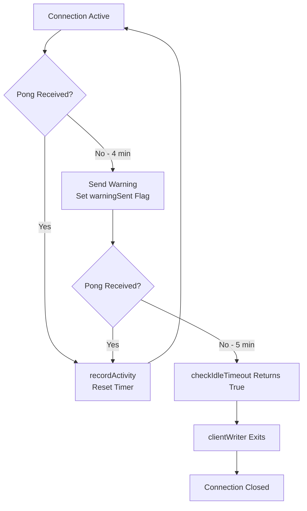

# WebSocket Connection Lifecycle Management

This document describes the WebSocket connection lifecycle in ChatPulse, including idle timeout detection, graceful shutdown, and operational metrics.

## Architecture Overview

ChatPulse uses a **pull-based broadcasting model** with per-connection write goroutines. Each WebSocket connection is managed by a `clientWriter` that handles:

- Buffered message delivery (non-blocking broadcast)
- Periodic ping/pong heartbeat (30s interval, 60s pong timeout)
- Idle timeout detection (5-minute inactivity threshold)
- Graceful shutdown with close frames

```
┌─────────────────────────────────────────────────────────────────┐
│                         Broadcaster                             │
│  (actor pattern - single goroutine owns all state)              │
│                                                                  │
│  ┌────────────────────────────────────────────────────────┐    │
│  │  Tick Loop (50ms)                                      │    │
│  │  • Pull values from Redis via Engine                   │    │
│  │  • Marshal JSON once per session                       │    │
│  │  • Fan out to all session clients                      │    │
│  └────────────────────────────────────────────────────────┘    │
│                                                                  │
│  ┌────────────────────────────────────────────────────────┐    │
│  │  Active Clients Map                                    │    │
│  │  session_uuid → {conn1, conn2, ...}                    │    │
│  └────────────────────────────────────────────────────────┘    │
└─────────────────────────────────────────────────────────────────┘
                          │
            ┌─────────────┼─────────────┐
            ▼             ▼             ▼
    ┌──────────────┐ ┌──────────────┐ ┌──────────────┐
    │ clientWriter │ │ clientWriter │ │ clientWriter │
    │  (goroutine) │ │  (goroutine) │ │  (goroutine) │
    └──────────────┘ └──────────────┘ └──────────────┘
         │                │                │
         │ writes         │ writes         │ writes
         ▼                ▼                ▼
    ┌──────────────┐ ┌──────────────┐ ┌──────────────┐
    │  WebSocket   │ │  WebSocket   │ │  WebSocket   │
    │  Connection  │ │  Connection  │ │  Connection  │
    └──────────────┘ └──────────────┘ └──────────────┘
```

## Connection Lifecycle

### 1. Connection Establishment

**Flow**: `GET /ws/overlay/:uuid` → Connection limits check → User lookup → Session activation → WebSocket upgrade → Broadcaster registration

```go
// Server handler (handlers_overlay.go)
func (s *Server) handleWebSocket(c echo.Context) error {
    connectionStart := time.Now()

    // 1. Parse and validate overlay UUID
    // 2. Check connection limits (rate, global, per-IP)
    // 3. Lookup user by overlay UUID
    // 4. Ensure session active in Redis
    // 5. Upgrade to WebSocket
    // 6. Register with broadcaster

    defer func() {
        duration := time.Since(connectionStart).Seconds()
        metrics.WebSocketConnectionDuration.Observe(duration)
    }()

    // Read pump - blocks until connection closes
    for {
        if _, _, err := conn.ReadMessage(); err != nil {
            break
        }
    }

    s.broadcaster.Unregister(user.OverlayUUID, conn)
    return nil
}
```

**Metrics**:
- `websocket_connections_total{result="success"}` - Successful upgrades
- `websocket_connections_total{result="error"}` - Failed upgrades
- `websocket_connections_rejected_total{reason}` - Connection limit rejections
- `websocket_connections_current` - Active connections gauge

### 2. Active Connection Phase

**clientWriter goroutine** (`writer.go:41-71`):

```go
func (cw *clientWriter) run() {
    ticker := cw.clock.NewTicker(pingInterval) // 30s
    defer ticker.Stop()

    for {
        select {
        case msg := <-cw.sendChannel:
            // Broadcast message delivery
            cw.connection.WriteMessage(websocket.TextMessage, msg)

        case <-ticker.Chan():
            // Check idle timeout before ping
            if cw.checkIdleTimeout() {
                return // Idle timeout - disconnect
            }
            // Send ping to client
            cw.connection.WriteMessage(websocket.PingMessage, nil)

        case <-cw.doneChannel:
            return // Shutdown signal
        }
    }
}
```

**Activity tracking**:
- `lastActivity` timestamp updated on pong receipt
- `recordActivity()` called by pong handler
- Resets idle timer and warning flag

**Metrics**:
- `websocket_message_send_duration_seconds` - Message send latency
- `websocket_ping_failures_total` - Failed ping attempts
- `broadcaster_slow_clients_evicted_total` - Clients with full send buffers

### 3. Idle Timeout Detection

**Configuration**:
```go
const (
    idleTimeout     = 5 * time.Minute  // Disconnect threshold
    idleWarningTime = 4 * time.Minute  // Warning threshold (1 min before disconnect)
    pongDeadline    = 60 * time.Second // Max time to wait for pong
)
```

**Flow**:



**Warning message** (sent at 4 minutes):
```json
{
  "warning": "Connection idle. Will disconnect if no activity within 1 minute."
}
```

**Disconnect behavior** (at 5 minutes):
- `checkIdleTimeout()` returns `true`
- `run()` goroutine exits
- Connection closed by defer in `stop()`
- Metric incremented: `websocket_idle_disconnects_total`

**Metrics**:
- `websocket_idle_disconnects_total` - Count of idle timeouts

### 4. Graceful Shutdown

**Triggered by**: Server shutdown (`SIGINT`/`SIGTERM`)

**Flow**: `broadcaster.Stop()` → Send close frames → Wait for goroutines → Close connections

```go
// broadcaster.go:283-295
func (b *Broadcaster) handleStop() {
    totalClients := 0
    for _, clients := range b.activeClients {
        totalClients += len(clients)
    }

    slog.Info("Broadcaster shutting down",
        "sessions", len(b.activeClients),
        "total_clients", totalClients)

    for sessionUUID, clients := range b.activeClients {
        for _, cw := range clients {
            cw.stopGraceful("Server shutting down")
        }
        delete(b.activeClients, sessionUUID)
        if b.onSessionEmpty != nil {
            b.onSessionEmpty(sessionUUID)
        }
    }

    slog.Info("Broadcaster shutdown complete",
        "disconnected_clients", totalClients)
}
```

**stopGraceful sequence** (`writer.go:95-109`):

1. **Signal shutdown**: `close(doneChannel)` → `run()` goroutine exits
2. **Wait for goroutine**: `wg.Wait()` → Ensures no concurrent writes
3. **Send close frame**: `WriteMessage(CloseMessage, reason)` with code 1000 (normal closure)
4. **Close connection**: `connection.Close()`

**Close frame format**:
- Code: `1000` (normal closure)
- Reason: `"Server shutting down"`

**Why this order matters**:
- Writing close frame while `run()` is active causes "concurrent write to websocket connection" panic
- Must wait for `run()` to exit before sending close frame
- `sync.Once` ensures idempotent shutdown (safe to call multiple times)

## Operational Metrics

### Connection Metrics

| Metric | Type | Description |
|--------|------|-------------|
| `websocket_connections_current` | Gauge | Active WebSocket connections |
| `websocket_connections_total{result}` | Counter | Total connection attempts (success/error/rejected) |
| `websocket_connections_rejected_total{reason}` | Counter | Rejections by reason (rate_limit/ip_limit/global_limit) |
| `websocket_connection_duration_seconds` | Histogram | Connection lifetime distribution |
| `websocket_idle_disconnects_total` | Counter | Idle timeout disconnections (>5 min no activity) |

### Broadcaster Metrics

| Metric | Type | Description |
|--------|------|-------------|
| `broadcaster_active_sessions` | Gauge | Number of sessions with active clients |
| `broadcaster_connected_clients_total` | Gauge | Total clients across all sessions |
| `broadcaster_slow_clients_evicted_total` | Counter | Clients evicted due to full send buffer |
| `broadcaster_tick_duration_seconds` | Histogram | Tick loop duration (target: <50ms) |
| `broadcaster_broadcast_duration_seconds` | Histogram | Per-session broadcast duration |

### Message Metrics

| Metric | Type | Description |
|--------|------|-------------|
| `websocket_message_send_duration_seconds` | Histogram | Individual message send latency |
| `websocket_ping_failures_total` | Counter | Failed ping attempts (client unresponsive) |

### Capacity Metrics

| Metric | Type | Description |
|--------|------|-------------|
| `websocket_connection_capacity_percent` | Gauge | Global connection capacity utilization (0-100%) |
| `websocket_unique_ips` | Gauge | Number of unique IP addresses with connections |

## Monitoring & Alerting

### Recommended Alerts

**High idle disconnect rate**:
```promql
rate(websocket_idle_disconnects_total[5m]) > 10
```
**Rationale**: Sudden spike indicates network issues or client bugs

**Connection capacity above 80%**:
```promql
websocket_connection_capacity_percent > 80
```
**Rationale**: Approaching global connection limit, may start rejecting clients

**High slow client eviction rate**:
```promql
rate(broadcaster_slow_clients_evicted_total[5m]) > 5
```
**Rationale**: Clients can't keep up with broadcast rate, may indicate network issues

**Tick loop slowness**:
```promql
histogram_quantile(0.99, rate(broadcaster_tick_duration_seconds_bucket[5m])) > 0.05
```
**Rationale**: P99 tick duration exceeds 50ms target, broadcasting may lag

### Grafana Dashboard Queries

**Connection duration distribution** (P50, P95, P99):
```promql
histogram_quantile(0.50, rate(websocket_connection_duration_seconds_bucket[5m]))
histogram_quantile(0.95, rate(websocket_connection_duration_seconds_bucket[5m]))
histogram_quantile(0.99, rate(websocket_connection_duration_seconds_bucket[5m]))
```

**Connection success rate**:
```promql
sum(rate(websocket_connections_total{result="success"}[5m]))
/
sum(rate(websocket_connections_total[5m]))
```

**Idle timeout rate** (disconnects per minute):
```promql
rate(websocket_idle_disconnects_total[1m]) * 60
```

**Active connections by session**:
```promql
broadcaster_connected_clients_total / broadcaster_active_sessions
```

## Troubleshooting

### Issue: High idle disconnect rate

**Symptoms**: `websocket_idle_disconnects_total` increasing rapidly

**Possible causes**:
1. Client network issues (mobile data, poor WiFi)
2. OBS browser source sleeping (when not visible)
3. Firewall dropping long-lived connections

**Investigation**:
```bash
# Check if disconnects correlate with specific sessions
grep "idle disconnect" /var/log/chatpulse.log | cut -d' ' -f3 | sort | uniq -c

# Check client distribution
curl -s localhost:8080/metrics | grep websocket_unique_ips
```

**Resolution**:
- If OBS-related: Reduce `idleTimeout` to 3 minutes (OBS browser sources wake on visibility)
- If firewall-related: Configure firewall to allow long-lived connections on port 443

### Issue: Connections stuck at capacity

**Symptoms**: `websocket_connection_capacity_percent` at 100%, `websocket_connections_rejected_total` increasing

**Investigation**:
```bash
# Check per-IP connection counts
curl -s localhost:8080/debug/connections | jq '.per_ip | to_entries | sort_by(.value) | reverse | .[:10]'

# Check active sessions
curl -s localhost:8080/metrics | grep broadcaster_active_sessions
```

**Resolution**:
- If single IP has many connections: Rate limit or block abusive IP
- If many legitimate clients: Increase global limit in `server.connLimits.Global()`
- If many zombie connections: Reduce `idleTimeout` or `pongDeadline`

### Issue: Slow client evictions

**Symptoms**: `broadcaster_slow_clients_evicted_total` increasing

**Investigation**:
```bash
# Check broadcast durations
curl -s localhost:8080/metrics | grep broadcaster_broadcast_duration_seconds

# Check message send durations
curl -s localhost:8080/metrics | grep websocket_message_send_duration_seconds
```

**Possible causes**:
1. Clients on slow networks (high latency, packet loss)
2. Broadcast rate too high (50ms ticks overwhelming slow clients)
3. Send buffer too small (`messageBufferSize = 16`)

**Resolution**:
- If client-side: Acceptable behavior (slow clients are disconnected)
- If server-side: Increase `messageBufferSize` to 32 or 64
- If broadcast rate: Increase `tickInterval` from 50ms to 100ms

### Issue: Graceful shutdown timeout

**Symptoms**: Logs show "Broadcaster Stop() timed out waiting for goroutine exit"

**Investigation**:
```go
// broadcaster.go:134-142
timeout := b.clock.NewTimer(10 * time.Second)
select {
case <-b.done:
    // Clean shutdown
case <-timeout.Chan():
    slog.Warn("Broadcaster Stop() timed out waiting for goroutine exit")
}
```

**Possible causes**:
1. Many clients (50+ per session) taking time to close
2. Slow network preventing close frame delivery
3. Deadlock in `clientWriter.stopGraceful()`

**Resolution**:
- Check logs for concurrent write panics (indicates bug in shutdown sequence)
- If many clients: Acceptable (10s timeout is sufficient for 50 clients)
- If deadlock: File bug report with goroutine stack trace

## Testing

### Unit Tests

**Idle timeout** (`writer_test.go:15-32`):
- Uses `clockwork.FakeClock` for deterministic time control
- Advances clock to 4 minutes → Verifies warning sent
- Advances clock to 5 minutes → Verifies disconnect signaled

**Activity reset** (`writer_test.go:34-51`):
- Advances clock 3 minutes → Records activity → Advances 3 more minutes
- Verifies client NOT timed out (6 minutes total, 3 since activity)
- Advances 3 more minutes → Verifies timeout (6 minutes since activity)

**Graceful stop** (`writer_test.go:53-73`):
- Registers client → Stops broadcaster
- Verifies close frame received with code 1000

### Integration Tests

**TestBroadcaster_CommandTimeoutHandling** (`broadcaster_test.go:503-565`):
- Blocks broadcaster tick loop with slow engine
- Verifies `Register()` times out after 5 seconds
- Verifies `GetClientCount()` returns `-1` on timeout

**TestBroadcasterStopCleansUpGoroutines** (`broadcaster_test.go:294-362`):
- Creates broadcaster with 5 clients across 2 sessions
- Calls `Stop()` → Verifies goroutines cleaned up
- Allows up to 10 residual goroutines (test infrastructure)

### Coverage

Current test coverage: **86.9%** (exceeds 85% requirement)

Run coverage report:
```bash
go test ./internal/broadcast -coverprofile=coverage.out
go tool cover -html=coverage.out
```

## Configuration Reference

### Constants (`writer.go`)

```go
const (
    writeDeadline     = 5 * time.Second   // Max time to write a message
    pingInterval      = 30 * time.Second  // Frequency of ping messages
    pongDeadline      = 60 * time.Second  // Max time to wait for pong
    idleTimeout       = 5 * time.Minute   // Disconnect idle clients
    idleWarningTime   = 4 * time.Minute   // Warn before disconnect
    messageBufferSize = 16                // Send channel capacity
)
```

### Constants (`broadcaster.go`)

```go
const (
    maxClientsPerSession = 50                // Max clients per overlay session
    tickInterval         = 50 * time.Millisecond  // Broadcast frequency
    redisTimeout         = 2 * time.Second   // Per-session Redis timeout
    commandTimeout       = 5 * time.Second   // Actor command timeout
)
```

### Tuning Guidelines

**For high-latency clients** (international, mobile):
- Increase `pongDeadline` to 90s or 120s
- Increase `messageBufferSize` to 32 or 64
- Increase `idleTimeout` to 10 minutes

**For low-latency clients** (LAN, datacenter):
- Decrease `pingInterval` to 15s or 20s
- Decrease `pongDeadline` to 30s or 45s
- Decrease `tickInterval` to 25ms or 30ms (lower latency)

**For high-scale deployments** (1000+ clients):
- Increase `maxClientsPerSession` to 100 or 200
- Increase `tickInterval` to 100ms (reduce Redis load)
- Increase `messageBufferSize` to 32 (tolerate transient slowness)

**For memory-constrained environments**:
- Decrease `maxClientsPerSession` to 25 or 30
- Decrease `messageBufferSize` to 8
- Increase `idleTimeout` to 10 minutes (disconnect idle sooner)

## References

- **Actor Pattern**: [Go Concurrency Patterns: Actor Model](https://www.cs.rit.edu/~ats/go-2011-2/actor.pdf)
- **WebSocket Protocol**: [RFC 6455](https://datatracker.ietf.org/doc/html/rfc6455)
- **Gorilla WebSocket**: [gorilla/websocket](https://github.com/gorilla/websocket)
- **Prometheus Metrics**: [prometheus/client_golang](https://github.com/prometheus/client_golang)

## Changelog

### 2026-02-12: WebSocket Lifecycle Enhancements (twitch-tow-d80)

**Added**:
- Idle timeout detection (5-minute threshold, 4-minute warning)
- Activity tracking via pong handler
- Idle warning messages to clients
- `websocket_idle_disconnects_total` metric
- Graceful shutdown with close frames
- Shutdown logging (session count, client count)

**Changed**:
- `stopGraceful()` now waits for `run()` goroutine before sending close frame
- `handleStop()` logs disconnection stats

**Fixed**:
- Concurrent write panic during graceful shutdown
- Race condition in `stopGraceful()` vs `run()` goroutine

**Test coverage**: 86.9% (+4.2% from 82.7%)
